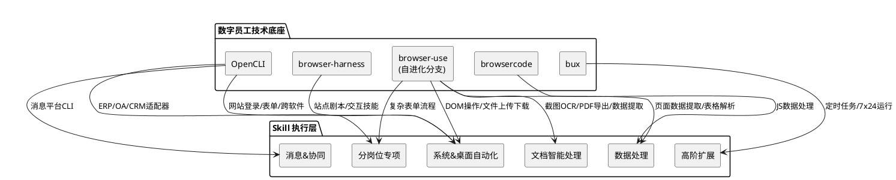
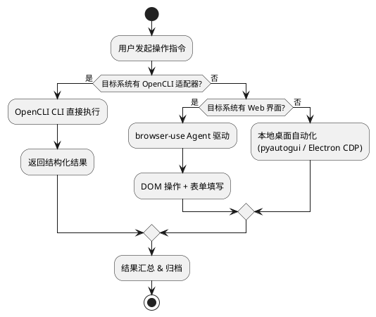
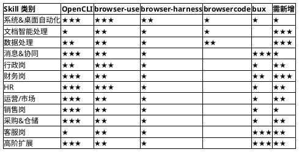
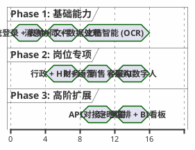
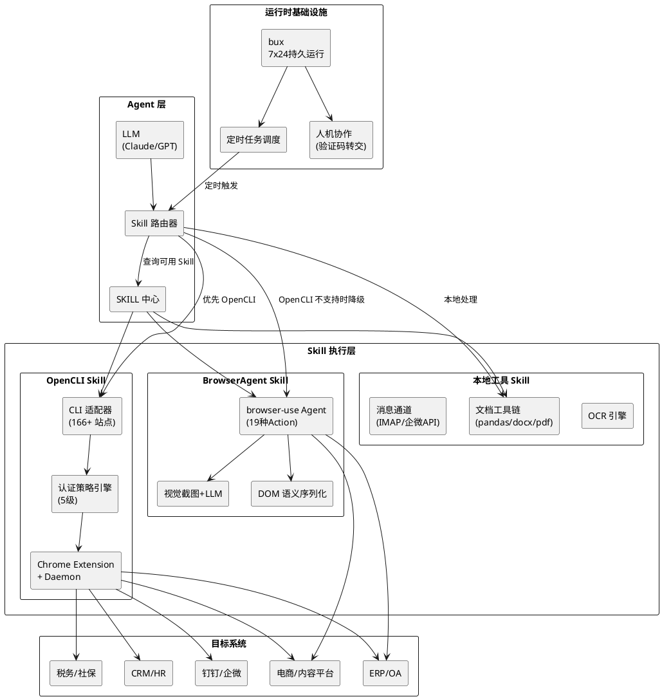
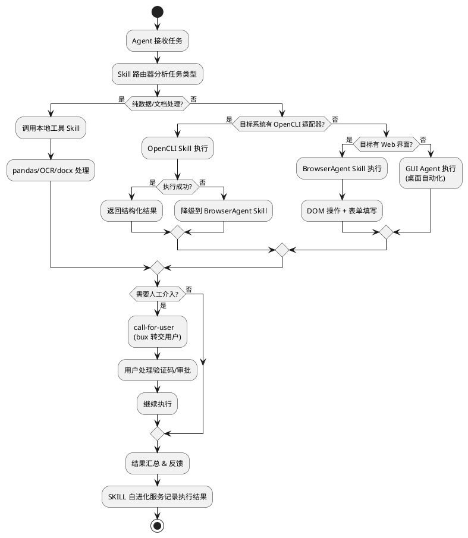

# 数字员工 Skill 需求规划与技术实现映射

> 本文档梳理数字员工全量 Skill 需求，分析各 Skill 与现有技术栈（OpenCLI / browser-use / browser-harness / browsercode / bux）的关联关系，并给出实现路径建议。

---

## 0 现有技术栈能力概览

| 项目 | 定位 | 核心能力 |
|------|------|---------|
| **OpenCLI** | 网站操作 CLI 化平台 | 166+ 站点适配器、CDP + Chrome Extension 桥接、5 级认证策略（PUBLIC→COOKIE→HEADER→INTERCEPT→UI）、AI Agent 自动生成适配器 |
| **browser-use** | AI 浏览器驱动库（我们的自进化分支） | 19 种浏览器操作 Action、DOM 语义序列化、LLM 多模型接入、表单填写/文件上传下载/截图/PDF 导出/数据提取、事件驱动看门狗体系 |
| **browser-harness** | 轻量 CDP 操控骨架 | 极简 CDP 原语、agent-workspace 自编写 helper、99+ domain-skill 站点剧本、交互技能库（上传/下载/拖拽/iframe/shadow DOM） |
| **browsercode** | 浏览器原生编码 Agent | 基于 OpenCode fork + browser-harness 移植、TUI/桌面/无头多入口、Agent 在浏览器内写执行 JS |
| **bux** | 7×24 部署平台 | VPS 一键部署 Claude Code + 持久浏览器、Telegram 多线程对话、Browser Use Cloud 集成、人机协作（验证码转交用户） |

---

## 1 全岗位通用基础 Skill

### 1.1 系统 & 桌面自动化 Skill

| # | Skill | 技术实现路径 | 关联项目 | 可行性 |
|---|-------|------------|---------|-------|
| 1 | 多系统自动登录、账号密码托管、页面跳转、菜单点击 | **OpenCLI**: 5 级认证策略（COOKIE/HEADER）天然支持登录态继承；密码托管需新建安全存储模块。**browser-use**: `NavigateAction` + `ClickElementAction` + `InputTextAction` 完成页面跳转和菜单点击。**bux**: 人机协作处理验证码/2FA | OpenCLI ★★★ / browser-use ★★★ / bux ★★ | 🟢 高 |
| 2 | 表单自动录入、下拉选择、弹窗拦截、报错重试 | **browser-use**: `InputTextAction`（自动清空+填入）、`SelectDropdownOptionAction` + `GetDropdownOptionsAction`、`PopupsWatchdog` 弹窗拦截、Action 超时重试机制。**OpenCLI**: YAML pipeline 中的 evaluate 步骤可执行表单填充 JS | browser-use ★★★ / OpenCLI ★★ | 🟢 高 |
| 3 | 文件批量下载/上传、文件夹自动分类归档 | **browser-use**: `UploadFileAction`（含安全路径校验）、`DownloadsWatchdog` 自动跟踪下载、`SaveAsPdfAction` PDF 导出。**browser-harness**: uploads/downloads 交互技能。文件夹归档需本地 FS 工具配合 | browser-use ★★★ / browser-harness ★★ | 🟢 高 |
| 4 | 浏览器/ERP/OA/钉钉/企微跨软件联动操作 | **OpenCLI**: 已有外部 CLI 包装能力（gh/docker/discord/wx），可扩展注册钉钉/企微/ERP CLI；Electron 应用支持（Cursor/ChatGPT 已有先例）。**browser-use**: MCP Client 模式可连接外部 MCP Server 扩展能力 | OpenCLI ★★★ / browser-use ★★ | 🟡 中 |

### 1.2 文档智能处理 Skill

| # | Skill | 技术实现路径 | 关联项目 | 可行性 |
|---|-------|------------|---------|-------|
| 5 | OCR 识别：PDF、图片、扫描件、发票、合同、单据文字提取 | **browser-use**: `ScreenshotAction` 截图 + LLM 多模态视觉能力提取文字（Claude Sonnet 自动缩放 1400x850）。需集成专业 OCR 引擎（Tesseract/PaddleOCR）处理高精度场景。发票识别推荐对接税务 OCR API | browser-use ★★（视觉）/ 需新增 OCR 引擎 | 🟡 中 |
| 6 | 文档格式转换：Word↔PDF↔Excel↔TXT 批量转换 | 需集成本地工具链：LibreOffice CLI（`soffice --convert-to`）、pandoc、python-docx/openpyxl。**OpenCLI** 可将转换能力注册为本地 CLI 命令 | 需新增工具链 / OpenCLI ★ | 🟡 中 |
| 7 | 合同/文件摘要提取、关键信息（金额/日期/甲方）抽取 | **browser-use**: `ExtractAction` LLM 语义提取 + JSON Schema 验证输出结构。结合 OCR 先提取文本，再用 LLM 抽取关键字段 | browser-use ★★ / LLM ★★★ | 🟢 高 |
| 8 | 批量重命名、拆分/合并 PDF、水印添加、文档查重 | 本地工具链：PyPDF2/pikepdf（拆分合并）、reportlab（水印）、simhash/minhash（查重）。**OpenCLI** 注册为本地 CLI | 需新增工具链 | 🟡 中 |

### 1.3 数据处理 Skill

| # | Skill | 技术实现路径 | 关联项目 | 可行性 |
|---|-------|------------|---------|-------|
| 9 | Excel 自动化：批量填数、函数运算、数据筛选、去重、透视表 | 本地 Python 工具链（openpyxl/pandas/xlsxwriter）。**browsercode**: Agent 可写 JS 处理数据。复杂场景可用 LLM 生成 pandas 代码执行 | browsercode ★★ / 需新增工具链 | 🟢 高 |
| 10 | 数据校验：异常值/空值/格式错误自动标记 | pandas + LLM 规则生成。**browser-use** `ExtractAction` 可从网页表格提取数据后校验 | browser-use ★ / 需新增 | 🟢 高 |
| 11 | 跨表格/跨系统数据同步、数据汇总统计 | **OpenCLI**: 多站点适配器可从不同系统拉取数据。**browser-use**: 多 Tab 操作支持跨系统。数据汇总用 pandas | OpenCLI ★★★ / browser-use ★★ | 🟡 中 |
| 12 | 报表自动生成、数据导出入库 | pandas + matplotlib/plotly 生成报表。入库需 DB 连接器。**browser-use** `SaveAsPdfAction` 可将报表页面导出 PDF | browser-use ★ / 需新增 | 🟡 中 |

### 1.4 消息 & 协同 Skill

| # | Skill | 技术实现路径 | 关联项目 | 可行性 |
|---|-------|------------|---------|-------|
| 13 | 企微/钉钉/邮箱消息自动收发、关键词消息抓取 | **OpenCLI**: 已有 wx（企微）CLI 包装，可扩展钉钉。邮箱推荐 IMAP/SMTP 直连。**browser-use**: Gmail 集成已有（OAuth2 + 2FA/OTP 读取）。**bux**: Telegram 消息收发已实现 | OpenCLI ★★★ / browser-use ★★ / bux ★★ | 🟢 高 |
| 14 | 定时推送日报/周报/预警消息、消息自动回执 | **bux**: systemd 定时任务 + Telegram 推送。**OpenCLI**: 可结合 cron 调度 CLI 命令 | bux ★★★ / OpenCLI ★★ | 🟢 高 |
| 15 | 日程创建、待办事项自动录入 OA | **OpenCLI**: 为 OA 系统生成适配器（COOKIE 策略）。**browser-use**: 通过表单填写能力录入 | OpenCLI ★★★ / browser-use ★★ | 🟢 高 |

---

## 2 分岗位专项数字员工 Skill

### 2.1 行政岗

| # | Skill | 技术实现路径 | 关联项目 | 可行性 |
|---|-------|------------|---------|-------|
| 1 | 考勤数据归集：打卡系统导出、异常考勤汇总 | **OpenCLI**: 为钉钉/企微打卡系统生成 CLI 适配器（COOKIE 策略），自动导出考勤数据。**browser-use**: `ExtractAction` 提取考勤表格数据 + pandas 汇总异常 | OpenCLI ★★★ / browser-use ★★ | 🟢 高 |
| 2 | 办公用品台账：出入库录入、库存预警、采购申请自动发起 | **browser-use**: 表单自动录入（`InputTextAction` + `SelectDropdownOptionAction`）。**OpenCLI**: OA 系统适配器提交采购申请。库存预警逻辑需规则引擎 | browser-use ★★ / OpenCLI ★★ | 🟡 中 |
| 3 | 会议筹备：通知群发、会议室预定、会议纪要 AI 生成归档 | **OpenCLI**: 企微/钉钉消息 CLI 群发通知。**browser-use**: OA 会议室预定表单操作。LLM 生成会议纪要 + **browser-use** `SaveAsPdfAction` 归档。**demo 优先级** | OpenCLI ★★ / browser-use ★★ / LLM ★★★ | 🟢 高 |
| 4 | 报销初审：单据 OCR、附件校验、格式合规检查 | OCR 引擎提取发票/收据信息 → LLM 规则校验（金额匹配、日期合规、重复检测）。**browser-use** 视觉能力辅助 | browser-use ★ / 需 OCR 引擎 | 🟡 中 |
| 5 | 固定资产台账更新、盘点数据自动汇总 | **OpenCLI**: ERP 资产模块适配器。**browser-use**: 表格数据提取汇总 | OpenCLI ★★ / browser-use ★★ | 🟡 中 |

### 2.2 财务岗

| # | Skill | 技术实现路径 | 关联项目 | 可行性 |
|---|-------|------------|---------|-------|
| 6 | 发票全流程：查验、勾选认证、信息自动入账 | **OpenCLI**: 税务系统（增值税发票综合服务平台）适配器，COOKIE 策略登录。**browser-use**: 发票勾选页面表单操作。OCR 提取发票信息。**demo 优先级** | OpenCLI ★★★ / browser-use ★★ | 🟡 中 |
| 7 | 银行流水抓取：网银下载、自动对账、未达账项标记 | **browser-use**: 网银页面操作（需人机协作处理 U 盾/短信验证）。**bux**: call-for-user 机制处理安全验证。pandas 对账逻辑 | browser-use ★★ / bux ★★ | 🟡 中 |
| 8 | 费用报销：报销单智能审核 | LLM 规则引擎 + OCR 提取 + 数据库查重。**browser-use** `ExtractAction` 从 OA 提取报销单数据 | browser-use ★★ / LLM ★★★ | 🟡 中 |
| 9 | 凭证自动生成：业务单据 → 财务凭证 | **OpenCLI**: 金蝶/用友 ERP 适配器。**browser-use**: 凭证录入表单操作。需业务规则映射引擎 | OpenCLI ★★ / browser-use ★★ | 🔴 难 |
| 10 | 税务辅助：进销项统计、纳税申报预填、税负测算 | **OpenCLI**: 税务系统适配器。**browser-use**: 申报表单预填。计算逻辑需税务规则引擎 | OpenCLI ★★ / browser-use ★★ | 🟡 中 |
| 11 | 应收应付对账：往来单据匹配、逾期统计提醒 | **OpenCLI**: ERP 应收应付模块适配器拉取数据。pandas 匹配对账。消息 Skill 推送逾期提醒 | OpenCLI ★★★ / 需新增 | 🟡 中 |

### 2.3 人力资源 HR

| # | Skill | 技术实现路径 | 关联项目 | 可行性 |
|---|-------|------------|---------|-------|
| 12 | 简历筛选：招聘平台抓取、关键词匹配、结构化入库 | **OpenCLI**: 招聘平台（Boss 直聘/猎聘/拉勾）适配器抓取简历列表。**browser-use**: `ExtractAction` 结构化提取简历字段（姓名/学历/经验/技能）+ JSON Schema 校验。LLM 关键词匹配打分 | OpenCLI ★★★ / browser-use ★★★ | 🟢 高 |
| 13 | 入职办理：员工信息自动录入 HR 系统、劳动合同同步 | **browser-use**: HR 系统表单批量录入。**OpenCLI**: HR 系统适配器（如有 API） | browser-use ★★★ / OpenCLI ★★ | 🟢 高 |
| 14 | 薪资核算：考勤+绩效数据汇总、社保公积金基数核算 | **OpenCLI**: 多系统数据拉取（考勤系统 + 绩效系统 + 社保系统）。pandas 计算核算。需薪资规则引擎 | OpenCLI ★★★ / 需新增 | 🟡 中 |
| 15 | 社保公积金：增减员数据提取、申报表单预填 | **browser-use**: 社保/公积金网站表单操作。**bux**: 人机协作处理 CA 证书验证 | browser-use ★★ / bux ★★ | 🟡 中 |
| 16 | 合同到期预警、试用期提醒、档案归档 | **OpenCLI**: HR 系统适配器定期拉取数据。规则引擎计算到期日。消息 Skill 推送提醒。文件归档用 FS 工具 | OpenCLI ★★ / bux ★★ | 🟢 高 |

### 2.4 运营/市场岗

| # | Skill | 技术实现路径 | 关联项目 | 可行性 |
|---|-------|------------|---------|-------|
| 17 | 多平台数据抓取：电商/短视频/公众号后台数据汇总 | **OpenCLI**: 已有 Bilibili/小红书/抖音等适配器，可扩展电商后台（淘宝/京东商家后台）。**browser-use**: `ExtractAction` 提取数据表格 | OpenCLI ★★★ / browser-use ★★ | 🟢 高 |
| 18 | 活动台账：报名信息收集、名单整理、效果复盘 | **browser-use**: 表单数据提取 + `ExtractAction`。pandas 汇总统计。LLM 生成复盘报告 | browser-use ★★ / LLM ★★ | 🟢 高 |
| 19 | 文案 AI 生成：活动文案/海报配文/朋友圈话术批量生成 | LLM 核心能力，不依赖浏览器。可通过 **browsercode** TUI 交互生成 | LLM ★★★ | 🟢 高 |
| 20 | 用户标签分类：客户信息归集、分层统计、营销消息批量推送 | **OpenCLI**: CRM 适配器拉取客户数据。LLM 标签分类。消息 Skill 批量推送 | OpenCLI ★★★ / LLM ★★ | 🟡 中 |
| 21 | PPT 生成与美化 | python-pptx 生成 + LLM 内容编排。**browser-use** 可操作在线 PPT 工具（如腾讯文档/Google Slides） | browser-use ★ / 需新增 | 🟡 中 |

### 2.5 销售岗

| # | Skill | 技术实现路径 | 关联项目 | 可行性 |
|---|-------|------------|---------|-------|
| 22 | CRM 数据自动录入：沟通记录/报价信息一键入 CRM | **OpenCLI**: CRM 系统适配器（Salesforce/纷享销客）。**browser-use**: CRM 表单填写 | OpenCLI ★★★ / browser-use ★★★ | 🟢 高 |
| 23 | 线索归集：表单/官网/广告线索自动抓取分配 | **OpenCLI**: 多渠道适配器抓取线索。**browser-use**: 官网表单数据提取。规则引擎分配业务员 | OpenCLI ★★★ / browser-use ★★ | 🟢 高 |
| 24 | 报价单自动生成：产品参数+价格自动填充 PDF | **browser-use**: `SaveAsPdfAction` 导出。python-docx/reportlab 生成 PDF 报价单模板。LLM 参数匹配 | browser-use ★ / 需新增 | 🟢 高 |
| 25 | 回款跟踪：到期应收提醒、对账函自动生成发送 | **OpenCLI**: ERP/CRM 适配器拉取应收数据。消息 Skill 推送提醒。LLM 生成对账函 + 邮件 Skill 发送 | OpenCLI ★★ / bux ★★ | 🟡 中 |

### 2.6 采购 & 仓储岗

| # | Skill | 技术实现路径 | 关联项目 | 可行性 |
|---|-------|------------|---------|-------|
| 26 | 库存数据自动同步：WMS 出入库抓取、安全库存预警 | **OpenCLI**: WMS 系统适配器（COOKIE/HEADER 策略）。规则引擎预警。消息 Skill 推送 | OpenCLI ★★★ | 🟢 高 |
| 27 | 供应商台账、比价汇总、采购订单录入 ERP | **OpenCLI**: ERP 采购模块适配器。**browser-use**: 比价页面数据提取 + ERP 表单录入 | OpenCLI ★★★ / browser-use ★★ | 🟡 中 |
| 28 | 入库单/送货单 OCR、单据与采购单匹配校验 | OCR 引擎提取单据信息。LLM + 规则引擎匹配校验。**browser-use** 视觉辅助 | 需 OCR 引擎 / LLM ★★ | 🟡 中 |

### 2.7 客服岗 AI 数字人

| # | Skill | 技术实现路径 | 关联项目 | 可行性 |
|---|-------|------------|---------|-------|
| 29 | 智能问答：知识库检索、常见问题自动回复 | LLM + RAG（向量检索知识库）。**bux**: Telegram 对话界面已支持。可扩展到企微/钉钉客服窗口 | bux ★★★ / LLM ★★★ | 🟢 高 |
| 30 | 工单处理：客户诉求生成工单、流转部门 | **OpenCLI**: 工单系统适配器。**browser-use**: 工单表单填写。LLM 分类诉求 + 规则引擎路由 | OpenCLI ★★ / browser-use ★★ | 🟡 中 |
| 31 | 通话/聊天记录摘要、投诉分类统计 | LLM 摘要生成 + 分类。ASR（语音转文字）对接。**browser-use** `ExtractAction` 从客服系统提取聊天记录 | LLM ★★★ / 需 ASR | 🟡 中 |

---

## 3 高阶扩展 Skill

| # | Skill | 技术实现路径 | 关联项目 | 可行性 |
|---|-------|------------|---------|-------|
| 1 | API 对接 Skill：ERP/CRM/WMS/金蝶/用友/自研系统 | **OpenCLI**: 核心能力——5 级认证策略 + AI 自动生成适配器。对有公开 API 的系统走 PUBLIC/HEADER；对 Web 系统走 COOKIE/INTERCEPT。**browser-use**: MCP Client 模式可连接外部系统 MCP Server | OpenCLI ★★★ / browser-use ★★ | 🟢 高 |
| 2 | 智能预警配置：库存/资金/逾期/合规异常触发预警 | 规则引擎（条件+阈值+动作）。**bux**: 7×24 运行 + Telegram 推送。**OpenCLI**: 定期拉取数据 CLI 命令 | bux ★★★ / OpenCLI ★★ | 🟢 高 |
| 3 | 定时任务编排：日/周/月定点跑报表、执行业务流程 | **bux**: systemd + cron 定时任务调度，已有基础设施。可扩展为任务编排引擎（DAG 依赖管理） | bux ★★★ | 🟢 高 |
| 4 | 数据看板自动刷新：汇总数据同步 BI 看板 | **OpenCLI**: 多源数据拉取。BI 工具 API 推送（Grafana/Metabase/PowerBI）。**browser-use**: 操作 BI 后台上传数据 | OpenCLI ★★ / browser-use ★ | 🟡 中 |

---

## 4 Skill 与现有项目关联强度矩阵

### 关键结论

| 项目 | 强关联 Skill 数 | 核心价值定位 |
|------|----------------|-------------|
| **OpenCLI** | **28/35**（80%） | 企业系统接入层——通过 CLI 化将 ERP/OA/CRM/WMS/税务/社保等系统操作标准化，是数字员工调用企业系统的首选通道 |
| **browser-use** | **25/35**（71%） | 浏览器操作执行层——处理 OpenCLI 无法覆盖的复杂 DOM 交互（表单流程、数据提取、视觉识别），是 OpenCLI 的互补和兜底 |
| **bux** | **12/35**（34%） | 运行时基础设施——提供 7×24 持久运行、定时调度、消息通道（Telegram）、人机协作（验证码转交），是数字员工的"身体" |
| **browser-harness** | **8/35**（23%） | 轻量执行原语——domain-skill 站点剧本库可加速特定站点适配，交互技能库（上传/下载/拖拽）补充 browser-use |
| **browsercode** | **3/35**（9%） | 开发者工具——Agent 在浏览器内写执行 JS，适合数据处理和调试场景 |

---

## 5 实施路线图

### Phase 1（0-3 月）：通用基础 Skill 构建

**目标**：完成全岗位通用能力，让数字员工能"登录系统、填写表单、收发消息"

| 优先级 | 工作项 | 依赖 |
|--------|-------|------|
| P0 | OpenCLI 适配器扩展：钉钉、企业微信、常用 OA 系统 | OpenCLI |
| P0 | browser-use 表单自动化 Skill 封装（登录→导航→填写→提交→校验） | browser-use |
| P0 | 文件批量处理 Skill（下载/上传/归档） | browser-use + FS 工具 |
| P1 | 消息收发 Skill（企微/钉钉/邮箱统一接口） | OpenCLI + IMAP/SMTP |
| P1 | 基础数据处理 Skill（Excel 读写、数据校验） | pandas + openpyxl |
| P2 | OpenCLI SKILL 中心集成 + SKILL 自进化服务原型 | OpenCLI + AI Agent |

### Phase 2（3-6 月）：岗位专项 Skill 开发

**目标**：按岗位优先级落地专项能力

| 优先级 | 工作项 | 依赖 |
|--------|-------|------|
| P0 | 行政岗：考勤归集 + 会议筹备 demo | OpenCLI + browser-use |
| P0 | HR：简历筛选 + 入职办理 | OpenCLI + browser-use + LLM |
| P0 | 运营/市场：多平台数据抓取 + 文案生成 | OpenCLI + LLM |
| P1 | 财务岗：发票全流程 demo + 银行流水 | OpenCLI + OCR + browser-use |
| P1 | 销售岗：CRM 录入 + 线索归集 | OpenCLI + browser-use |
| P2 | 采购&仓储：WMS 同步 + OCR 单据匹配 | OpenCLI + OCR |
| P2 | 客服岗：智能问答 + 工单处理 | bux + LLM + RAG |

### Phase 3（6-12 月）：高阶扩展与平台化

**目标**：构建自运维、可编排的数字员工平台

| 优先级 | 工作项 | 依赖 |
|--------|-------|------|
| P0 | API 对接 Skill 标准化（ERP/CRM/WMS 连接器） | OpenCLI |
| P0 | 定时任务编排引擎 | bux |
| P1 | 智能预警配置平台 | 规则引擎 + bux |
| P1 | SKILL 自进化服务上线（自动维护/修复失效适配器） | OpenCLI + AI Agent |
| P2 | 数据看板自动刷新 | BI API |

---

## 6 技术架构：Skill 执行全景

### Skill 调用决策流程

---

## 7 需要新增的技术组件

现有技术栈无法覆盖的能力缺口，需新增以下组件：

| 组件 | 用途 | 建议方案 | 关联 Skill |
|------|------|---------|-----------|
| **OCR 引擎** | 发票/合同/单据文字提取 | PaddleOCR（中文优势）或 Tesseract + 专业发票 OCR API | #5, #4(行政), #6(财务), #28(采购) |
| **文档工具链** | Word/PDF/Excel 批量处理 | python-docx + openpyxl + PyPDF2 + reportlab + pandoc | #6, #8, #9, #24(销售) |
| **规则引擎** | 业务规则校验（报销/薪资/库存预警） | 轻量规则 DSL 或 LLM 驱动的规则解释器 | #4(行政), #8-10(财务), #14(HR), #26(采购) |
| **RAG 知识库** | 客服智能问答 | 向量数据库（Milvus/Chroma）+ Embedding 模型 | #29(客服) |
| **ASR 引擎** | 通话录音转文字 | Whisper / 阿里云 ASR | #31(客服) |
| **任务编排引擎** | 定时/依赖/并行任务调度 | 基于 bux 扩展，或集成 Temporal/Prefect | #3(高阶) |
| **安全存储** | 账号密码/Token 托管 | keyring + 加密存储，或 Vault | #1(基础) |

---

## 8 DOM 预处理能力与 Skill 的关系

参见《DOM 预处理与 LLM 输入优化分析》文档。browser-use（我们的自进化分支）在 DOM 处理上的以下特性直接影响数字员工 Skill 的执行质量：

| DOM 能力 | 影响的 Skill 场景 | 当前状态 |
|---------|-----------------|---------|
| **表格结构保留**（TR/TD/TH 序列化） | 考勤表/财务报表/库存台账等表格数据提取精度 | ✅ 已支持 |
| **伪元素序列化**（::before/::after → 可读文本） | 图标按钮识别（购物车/删除/展开），影响 ERP/CRM 操作准确性 | ✅ 已支持 |
| **离屏元素检测** | 减少幽灵元素干扰，提升表单定位精度 | ✅ 已支持 |
| **Paint Order 遮挡过滤** | 去除弹窗/遮罩下的不可点击元素 | ✅ 已支持 |
| **日期格式自动提示**（P0 待引入） | 财务/HR 日期输入准确性（入账日期/入职日期/合同起止日） | ❌ 待从 browser-use 上游移植 |
| **复合控件注解**（P1 待引入） | 文件上传框/下拉框/日期选择器的正确操作 | ❌ 待从 browser-use 上游移植 |
| **MessageCompaction 历史压缩**（P1 待引入） | 长流程任务（30+ 步报表生成/批量录入）的上下文稳定性 | ❌ 待从 browser-use 上游移植 |

---

## 附录 A：Skill 编号与项目对照速查

| Skill 编号 | Skill 名称 | OpenCLI | browser-use | bux | 需新增 |
|-----------|-----------|---------|-------------|-----|--------|
| 基础-1 | 多系统自动登录 | ● | ● | ○ | |
| 基础-2 | 表单自动录入 | ○ | ● | | |
| 基础-3 | 文件批量下载/上传 | | ● | | |
| 基础-4 | 跨软件联动 | ● | ○ | | |
| 基础-5 | OCR 识别 | | ○ | | ● |
| 基础-6 | 文档格式转换 | | | | ● |
| 基础-7 | 合同摘要提取 | | ● | | |
| 基础-8 | PDF 拆分/合并/水印 | | | | ● |
| 基础-9 | Excel 自动化 | | | | ● |
| 基础-10 | 数据校验 | | ○ | | ● |
| 基础-11 | 跨系统数据同步 | ● | ○ | | |
| 基础-12 | 报表自动生成 | | ○ | | ● |
| 基础-13 | 消息自动收发 | ● | ○ | ● | |
| 基础-14 | 定时推送 | ○ | | ● | |
| 基础-15 | 日程/待办录入 OA | ● | ○ | | |
| 行政-1 | 考勤数据归集 | ● | ○ | | |
| 行政-2 | 办公用品台账 | ○ | ○ | | |
| 行政-3 | 会议筹备 | ○ | ○ | | |
| 行政-4 | 报销初审 | | ○ | | ● |
| 行政-5 | 固定资产台账 | ○ | ○ | | |
| 财务-6 | 发票全流程 | ● | ○ | | ● |
| 财务-7 | 银行流水抓取 | | ○ | ○ | |
| 财务-8 | 费用报销审核 | | ○ | | ● |
| 财务-9 | 凭证自动生成 | ○ | ○ | | ● |
| 财务-10 | 税务辅助 | ○ | ○ | | ● |
| 财务-11 | 应收应付对账 | ● | | | |
| HR-12 | 简历筛选 | ● | ● | | |
| HR-13 | 入职办理 | ○ | ● | | |
| HR-14 | 薪资核算 | ● | | | ● |
| HR-15 | 社保公积金 | | ○ | ○ | |
| HR-16 | 合同到期预警 | ○ | | ○ | |
| 运营-17 | 多平台数据抓取 | ● | ○ | | |
| 运营-18 | 活动台账 | | ○ | | |
| 运营-19 | 文案 AI 生成 | | | | |
| 运营-20 | 用户标签分类 | ● | | | |
| 运营-21 | PPT 生成 | | ○ | | ● |
| 销售-22 | CRM 录入 | ● | ● | | |
| 销售-23 | 线索归集 | ● | ○ | | |
| 销售-24 | 报价单生成 | | ○ | | ● |
| 销售-25 | 回款跟踪 | ○ | | ○ | |
| 采购-26 | 库存同步 | ● | | | |
| 采购-27 | 供应商台账 | ● | ○ | | |
| 采购-28 | OCR 单据匹配 | | | | ● |
| 客服-29 | 智能问答 | | | ● | ● |
| 客服-30 | 工单处理 | ○ | ○ | | |
| 客服-31 | 通话记录摘要 | | | | ● |
| 高阶-1 | API 对接 | ● | ○ | | |
| 高阶-2 | 智能预警 | ○ | | ● | ● |
| 高阶-3 | 定时任务编排 | | | ● | |
| 高阶-4 | BI 看板刷新 | ○ | ○ | | |

> ● = 强关联（核心实现依赖）　○ = 辅助关联（可选使用）
