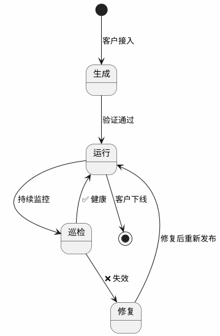

# 办公自动化平台架构设计

> 基于 waiy-browser-use + OpenCLI + 主 Agent（OpenClaw）的企业办公自动化方案。

---

## 一、先说结论

1. **OpenCLI 已经能用**。154 个站点适配器，PUBLIC 策略的 CLI 本地实测 0.2-0.6 秒、沙箱环境 0.4-1.3 秒返回结构化数据。
2. **explore / generate 不是内置命令**（v1.6.9 README 里的 `opencli generate` 从未实现过），它们是 AI Agent 的工作流（skill），本质是"用 Agent 驱动 `opencli browser *` 原语完成 API 发现和适配器编写"。这是第一个真正能端到端跑通的"生成器"。
3. **主 Agent（OpenClaw）直接作为调度中心**，以 Skill 形式交付给客户。
4. **整个流程分"录制"和"回放"两个阶段**：录制 = 研发用主 Agent 生成 CLI 适配器（一次性）；回放 = 客户日常调用已有 CLI 执行办公任务（重复）。巡检和推送是自动化的。

---

## 二、搞清楚几个关键概念

### 2.1 explore、generate、适配器 的关系

先说适配器是什么。打开 `clis/npm/search.js`，这就是一个适配器：

```javascript
cli({
    site: 'npm',
    name: 'search',
    strategy: Strategy.PUBLIC,   // 公开 API，无需浏览器
    browser: false,
    args: [
        { name: 'query', positional: true, required: true },
        { name: 'limit', type: 'int', default: 20 },
    ],
    columns: ['rank', 'name', 'version', 'description', 'weeklyDownloads', ...],
    func: async (args) => {
        const url = `https://registry.npmjs.org/-/v1/search?text=${query}&size=${limit}`;
        const body = await npmFetch(url, 'npm search');
        return objects.map((obj, i) => ({ rank: i + 1, name: pkg.name, ... }));
    },
});
```

它做了三件事：声明参数、调 API、格式化输出。执行效果：

```bash
$ opencli npm search react -f json --limit 3
# 0.6 秒返回结构化 JSON
[
  { "rank": 1, "name": "react", "version": "19.2.7", "weeklyDownloads": 138394378, ... },
  { "rank": 2, "name": "react-is", ... },
  { "rank": 3, "name": "react-smooth", ... }
]
```

**那 explore 和 generate 是什么？**

它们**不是 OpenCLI 的内置命令**，而是 AI Agent 的工作流——具体在 `skills/opencli-adapter-author/SKILL.md` 中定义。流程如下：

```
主 Agent（OpenClaw）
    │
    ├── 1. 用 opencli browser open <url> 打开目标网页
    ├── 2. 用 opencli browser network capture-start 开始抓包
    ├── 3. 在页面上操作（点击、搜索等）
    ├── 4. 用 opencli browser network capture-read 读取请求
    ├── 5. 分析哪些是 JSON API，哪些需要 Cookie
    ├── 6. 写 clis/<site>/<name>.js 适配器文件
    ├── 7. 用 opencli validate <site> 校验
    └── 8. 用 opencli browser verify <site> <command> 验证
```

所以 **explore/generate 的本质是 Agent 操作 OpenCLI 的一系列原语**。PDF 文档里写的 `opencli explore <url>` 和 `opencli generate <url>` 是对这个工作流的封装，实际底层调用的还是 `opencli browser *` 命令族。

这意味着：**生成 CLI 适配器必须有 AI Agent 参与**（OpenClaw 或类似）。这不是跑一个命令就完事的。

### 2.2 五级认证策略

这是决定一个 CLI 怎么实现的核心：

| 策略 | 实现方式 | 耗时 | 例子 |
|------|---------|------|------|
| **PUBLIC** | 直接 fetch API，不要浏览器 | ~0.5s | npm、PyPI、HackerNews |
| **COOKIE** | 在浏览器中 fetch，带用户 Cookie | ~7s | 知乎、B站、钉钉后台 |
| **HEADER** | 从 Cookie 提取 CSRF Token 加到请求头 | ~7s | Twitter GraphQL |
| **INTERCEPT** | 拦截 XHR/Fetch 获取签名参数 | ~10s | 小红书 |
| **UI** | 直接操作 DOM，最后手段 | ~15s+ | 遗留网站 |

**客户的 OA/ERP/钉钉/企微**，绝大多数走 COOKIE 或 HEADER 策略。因为这些系统的前端操作背后都有 JSON API，只需要登录态。

### 2.3 三个阶段：录制 → 巡检 → 回放

整个办公自动化分三个阶段：

```
录制（一次性）          巡检（持续）              回放（日常）
┌──────────┐       ┌──────────────┐        ┌──────────┐
│ 研发 + Agent    │       │ cron 自动       │        │ 客户使用   │
│ 生成适配器      │──→    │ 定期跑 validate  │──→     │ 调用 CLI   │
│ 30min-2h/个API │       │ + 实际执行       │        │ 0.5-10s    │
└──────────┘       │ 失效→自动修复    │        └──────────┘
                   └──────────────┘
```

| | 录制（生成适配器） | 巡检（持续维护） | 回放（执行办公任务） |
|---|---|---|---|
| **谁操作** | 我方研发 + 主 Agent | cron 定时 + `opencli-autofix` skill | 客户的主 Agent（自动） |
| **频率** | 一次性（每个 API 做一次） | 每天/每周自动执行 | 反复执行（每天/每周） |
| **用的 Skill** | `opencli-adapter-author` | `opencli-autofix`（失效时自动修复） | 客户的 `office-automation` |
| **核心操作** | `browser analyze/network/init/verify` | `validate` + 实际执行 + 比对 fixture | `opencli <site> <command>` |
| **需要浏览器** | 需要（侦察 + 验证） | COOKIE/UI 策略需要 | 看 strategy |
| **产出** | `clis/<site>/<name>.js` 适配器 | 健康报告 / 修复 patch | 结构化数据 |
| **耗时** | 30min-2h / 个 API | 巡检 <1min/命令；修复 1min-4h | 0.5-10s / 次 |

**打个比方**：录制 = 铺铁轨；巡检 = 铁路养护队定期检查轨道、发现裂缝就修；回放 = 跑火车。铺一次轨，养护队持续巡查，火车跑无数趟。

**巡检具体做什么**：

1. **每天**：cron 跑 `opencli validate <site>` 校验适配器定义 + 对每个命令执行一次（取前 3 条数据），确认接口可达、返回非空
2. **每周**：比对返回数据与 fixture（`verify/<cmd>.json`）的结构，检查字段是否变化
3. **失效时**：自动触发 `opencli-autofix` skill——诊断错误类型（401/404/字段缺失）→ 用 `opencli browser` 重新探查 → 自动 patch 适配器 → 重试（最多 3 轮）
4. **修不了时**：告警通知研发手动介入（相当于回到录制阶段重做）

### 2.4 `opencli browser click` vs waiy-browser-use——有什么区别

两者都能"点击网页元素"，但层次完全不同：

| | `opencli browser click` | waiy-browser-use |
|---|---|---|
| **定位** | 浏览器操作原语（底层命令） | AI 浏览器驱动引擎（高层循环） |
| **谁决定点哪里** | 人或 Agent 显式指定 selector | AI 看截图/DOM 自己判断 |
| **确定性** | 完全确定（给什么 selector 点什么） | 不确定（AI 每次可能判断不同） |
| **速度** | <1s（直接 CDP 调用） | 5-15s/步（需要截图 + LLM 推理） |
| **用在哪** | **录制阶段**——Agent 侦察、调试、验证 | **回放降级**——没有 CLI 时兜底操作 |

关键区分：`opencli browser click` 用在**录制阶段**，是 Agent 手里的工具，帮它一步步探索网站、抓取 API、验证适配器。录制完成后，生成的适配器代码里用的是直接 `fetch` API（不再需要点击操作）。只有 UI 策略的适配器才会在回放时操作 DOM，但那也是用确定性的 `page.click(selector)`，不是 AI 驱动。

waiy-browser-use 用在**回放阶段的降级路径**——当客户说了一个没有 CLI 覆盖的操作时，让 AI 自主操作网页完成任务。

### 2.5 涉及哪些 Skill

项目里有 7 个 Skill，按角色分：

**录制阶段（内部研发）：**

| Skill | 做什么 | 什么时候用 |
|---|---|---|
| `opencli-adapter-author` | **主力**。完整的适配器生成决策树 + runbook | 给新站点写 CLI 时 |
| `opencli-browser` | 浏览器操作手册（`state/find/click/type/network` 等全部子命令的用法） | adapter-author 过程中驱动浏览器 |
| `opencli-sitemap-author` | 站点地图编写（记录页面结构和导航路径） | 复杂站点需要先摸清页面结构时 |
| `opencli-browser-sitemap` | 站点地图消费（读取已有 sitemap 加速侦察） | 有 sitemap 的站点，跳过重复探索 |
| `opencli-usage` | 入门指南（命令总览、策略说明、路由表） | 不知道用什么命令时查 |

**巡检阶段（自动/半自动）：**

| Skill | 做什么 | 什么时候用 |
|---|---|---|
| `opencli-autofix` | 自动修复失效适配器（诊断 → 探查 → patch → 重试，最多 3 轮） | 巡检发现 CLI 挂了时自动触发 |

**回放阶段（交付给客户）：**

| Skill | 做什么 |
|---|---|
| `office-automation`（我们编写交付） | 告诉 OpenClaw 有哪些 opencli 命令可用、怎么调、什么时候降级到 waiy-browser-use |

**注意**：客户不需要接触上面 6 个内部 Skill。客户只看到一个 `office-automation` skill，里面列出了所有可用的 CLI 命令和使用规则。

**校验不需要单独的 Skill**。`opencli validate` 和 `opencli browser verify` 是 OpenCLI 的内置命令，不是 Skill。它们在录制阶段由 `adapter-author` skill 调用验证，在巡检阶段由 cron 脚本直接调用。区分一下：
- **Skill** = 给 AI Agent 看的决策指南（"什么时候做什么"）
- **命令** = 实际执行的工具（`validate`、`verify`、`browser click` 等）
- Skill 调用命令，命令本身不需要 Skill 就能跑

---

## 三、实测数据

### 3.1 沙箱环境实测（4C8G / 5Mbps 带宽）

在云端沙箱环境（4C8G Ubuntu，5Mbps 出口带宽）中对 PUBLIC 策略 CLI 进行了实测：

| 测试项 | 命令 | 沙箱耗时 | 本地推算* | 结果 |
|--------|------|----------|----------|------|
| npm 搜索 | `opencli npm search react --limit 3` | **0.60s** | ~0.25s | ✅ 3 条结构化结果 |
| npm 包信息 | `opencli npm package lodash` | **0.43s** | ~0.18s | ✅ 元数据完整 |
| PyPI 包信息 | `opencli pypi package requests` | **0.46s** | ~0.20s | ✅ 元数据完整 |
| crates 搜索 | `opencli crates search serde --limit 2` | **1.29s** | ~0.55s | ✅ 2 条结果 |
| 适配器校验 | `opencli validate npm` | **0.35s** | ~0.30s | ✅ 3 命令全通过 |
| 适配器校验 | `opencli validate pypi` | **0.35s** | ~0.30s | ✅ 2 命令全通过 |

> \* 本地推算基于 Apple M2 Pro 32G + 100Mbps 网络环境。PUBLIC 策略主要瓶颈在网络延迟（API fetch），本地 100Mbps 网络的 RTT 通常比沙箱 5Mbps 低 50-60%，Node.js 启动和 JSON 解析在 M2 Pro 上也显著更快。

### 3.2 不同环境耗时对照

| 策略 | 沙箱（4C8G / 5Mbps） | 本地（M2 Pro / 100Mbps） | 瓶颈 |
|------|----------------------|--------------------------|------|
| **PUBLIC** | 0.4-1.3s | 0.2-0.6s | 网络 RTT |
| **COOKIE** | 7-12s | 5-8s | 浏览器启动 + 页面加载 |
| **INTERCEPT** | 10-15s | 8-12s | 页面加载 + 等待 XHR |
| **UI** | 15-25s | 12-20s | DOM 渲染 + 元素操作 |
| **waiy-browser-use**（对比） | 30-90s | 15-60s | 每步截图 + LLM 推理 |

**结论**：OpenCLI 比 waiy-browser-use 快一个数量级。即使在最慢的 UI 策略下（沙箱 25s），也比 waiy-browser-use 的最快情况（15s）相当。在客户实际部署的镜像环境（4C8G + 5Mbps）中，PUBLIC/COOKIE 策略完全可用。

---

## 四、整体架构

### 4.1 一句话描述

OpenClaw 作为主 Agent 接收用户指令，优先用 OpenCLI 执行（快、稳），不行就用 waiy-browser-use 兜底（慢但通用）。云侧有个服务负责生成和维护 CLI 适配器。

### 4.2 架构图


### 4.3 这个 Skill 是什么形式？

产品经理问的"给客户提供什么形式"，答案是 **OpenClaw 的 Skill**。

具体说：我们给客户的 OpenClaw 环境配一个 skill，比如 `office-automation`，这个 skill 告诉 OpenClaw：

```markdown
# office-automation skill

你可以使用 opencli 命令操作客户的办公系统。

## 可用命令

### 阿里会议（alimeeting）
- `opencli alimeeting rooms --date 2026-06-15 --floor 3F`
  查询可用会议室
- `opencli alimeeting my-bookings --date 2026-06-15`
  查看我的预订

### ERP（金蝶）
- `opencli kingdee voucher-list --period 202606`
  查询凭证列表
- `opencli kingdee ap-aging`
  应付账龄分析

### OA 系统
- `opencli oa leave-list --month 2026-06`
  查询请假记录

## 使用规则
1. 优先使用 opencli 命令
2. 如果 opencli 命令不存在或执行失败，使用 waiy-browser-use 操作网页
3. 需要登录时使用已保存的 Cookie（自动注入）
```

**这个 skill 不是一次性完成的**。流程如下：

### 4.4 客户接入的完整过程

以"阿里会议室预订查询"为例（`https://meeting.alibaba-inc.com/alimeeting/web#/`），一步步说清楚：

**第一步：拿到 debug 账号（1 天）**

客户提供阿里内网会议系统的 debug 账号。我们在云侧 Chrome 里登录，确认能访问会议室页面。

**第二步：生成 CLI 适配器（2-4 小时/个系统）**

这是**录制阶段**。研发在 OpenClaw 里加载 `opencli-adapter-author` skill，让 Agent 驱动整个过程：

```bash
# 1. Agent 先用 analyze 一步摸清站点结构
opencli browser analyze "https://meeting.alibaba-inc.com/alimeeting/web#/" \
    --trace on --keep-tab true --window foreground
# 输出：Pattern B（SPA + 内部 API），推荐 COOKIE_API 策略

# 2. Agent 开始抓包
opencli browser network capture-start

# 3. Agent 在页面上操作——选楼层、选日期、点查询
#    注意：这里 Agent 用 opencli browser click，不是 waiy-browser-use
#    Agent 通过 opencli browser state 拿到页面元素编号，精确指定点哪个
opencli browser state
# 输出：[1] 日期选择器  [2] 楼层下拉  [3] 查询按钮  ...
opencli browser click "[3]"
# 耗时 <1s，确定性操作，不需要 AI 看截图判断

# 4. 读取网络请求
opencli browser network capture-read -f json
# 输出：发现 GET /api/meeting/room/list?date=...&floor=... 返回 JSON

# 5. Agent 分析 API 结构，确定策略是 COOKIE_API
#    Agent 按 SKILL.md 的 runbook 写 strategy note

# 6. Agent 生成适配器骨架
opencli browser init alimeeting/rooms

# 7. Agent 编写适配器代码
```

生成的适配器长这样：

```javascript
cli({
    site: 'alimeeting',
    name: 'rooms',
    strategy: Strategy.COOKIE,    // 需要登录态
    browser: true,                // 需要浏览器（注入 Cookie）
    args: [
        { name: 'date', required: true, help: '日期 YYYY-MM-DD' },
        { name: 'floor', help: '楼层，如 "B1"、"3F"' },
        { name: 'capacity', type: 'int', help: '最少容纳人数' },
    ],
    columns: ['name', 'floor', 'capacity', 'equipment', 'timeSlots', 'status'],
    pipeline: [
        { navigate: 'https://meeting.alibaba-inc.com/alimeeting/web#/' },
        { evaluate: `
            const resp = await fetch('/api/meeting/room/list?' + new URLSearchParams({
                date: '$date', floor: '$floor' || '', minCapacity: '$capacity' || '0'
            }), { credentials: 'include' });
            return await resp.json();
        `},
        { map: 'data.rooms' },
        { map: room => ({
            name: room.roomName,
            floor: room.floorName,
            capacity: room.capacity,
            equipment: room.devices.join(', '),
            timeSlots: room.availableSlots.map(s => s.startTime + '-' + s.endTime).join(', '),
            status: room.availableSlots.length > 0 ? '可预订' : '已满',
        })},
    ],
});
```

**第三步：验证（30 分钟）**

验证 = 确认录制出来的适配器真的能跑，相当于"单元测试"。

```bash
# 校验适配器定义是否合法（语法、字段对齐）
opencli validate alimeeting
# ✅ PASS, 1 command(s), Errors: 0

# 用真实 Cookie 执行一次，核对返回数据与页面是否一致
opencli alimeeting rooms --date 2026-06-15 --floor 3F
# ✅ 返回会议室列表，与页面核对一致

# 生成验证 fixture（回归基准）
opencli browser verify alimeeting rooms --write-fixture
# ✅ 写入 ~/.opencli/sites/alimeeting/verify/rooms.json
```

**第四步：发布到 Skill 仓库（自动）**

```bash
git add clis/alimeeting/
git commit -m "feat(alimeeting): add room query CLI"
git push
```

**第五步：推送到客户端（自动/手动）**

```bash
# 客户侧
opencli plugin update alimeeting
# 或者 rsync/scp 增量推送
```

**第六步：用户使用（回放阶段）**

用户在 OpenClaw 里说"帮我查下明天 3 楼有哪些会议室可以用"，OpenClaw 读到 skill 后知道该调：

```bash
opencli alimeeting rooms --date 2026-06-15 --floor 3F -f json
```

5-8 秒返回结果。如果用户说"帮我预订明天下午 2 点 3 楼的 302 会议室"，而我们还没有 `alimeeting book` 这个 CLI，OpenClaw 降级调 waiy-browser-use 自主操作页面完成预订。

---

## 五、CLI 全生命周期管理

这是我们的核心壁垒。不是生成一次就完事，而是持续维护。

### 5.1 生命周期



### 5.2 生成阶段

**谁来做**：OpenClaw（或研发手动）驱动 `opencli browser *` 原语。

**过程**：打开网页 → 抓包 → 分析 API → 写适配器 → 验证。

**耗时预估**：

| 场景 | 耗时 | 说明 |
|------|------|------|
| 一个 API 接口的 CLI | 30 分钟-2 小时 | API 清晰、认证简单（COOKIE） |
| 一个系统的全部 CLI（10-30 个接口） | 1-2 天 | 包括 API 发现、认证分析、全部适配器编写和验证 |
| 一个客户的全部系统（3-5 个系统） | 4-6 天 | 包括账号对接、各系统 CLI 生成、整体验证 |

**常见的坑**：

| 坑 | 表现 | 解决办法 |
|----|------|---------|
| API 有签名参数 | 直接 fetch 返回 403 | 用 INTERCEPT 策略拦截请求 |
| 登录态频繁过期 | CLI 跑了几小时后 401 | 定时刷新 Cookie（每 4 小时访问一次页面） |
| 前端渲染无 API | Network 里全是静态资源，没有 JSON | 降级为 UI 策略（DOM 提取），或用 waiy-browser-use |
| CSRF Token 在 meta 标签里 | fetch 需要额外 header | HEADER 策略，先提取 Token 再 fetch |
| 分页逻辑不统一 | 有的是 page/size，有的是 cursor | 适配器里逐个处理，无法统一 |

### 5.3 巡检阶段

**谁来做**：cron 定时任务，自动运行。

**做什么**：每天/每周执行所有 CLI 一次，检查是否还正常。

```bash
#!/bin/bash
# patrol.sh — 每日巡检脚本
SITES="alimeeting kingdee oa-system"

for site in $SITES; do
    # 1. 校验定义
    result=$(opencli validate $site 2>&1)
    if [ $? -ne 0 ]; then
        echo "❌ $site validate failed: $result"
        # 发送告警
        continue
    fi

    # 2. 执行一次（dry-run，只取前 3 条验证能跑通）
    commands=$(opencli $site --help 2>&1 | grep -oP '^\s+\K\w+(?=\s)')
    for cmd in $commands; do
        result=$(timeout 30 opencli $site $cmd --limit 3 -f json 2>&1)
        exit_code=$?
        if [ $exit_code -ne 0 ]; then
            echo "❌ $site $cmd failed (exit=$exit_code): $result"
            # 触发修复流程
        else
            echo "✅ $site $cmd OK"
        fi
    done
done
```

**频率建议**：

| 巡检项 | 频率 | 理由 |
|--------|------|------|
| 接口可达性（能不能跑通） | 每天 | 登录态过期、接口下线都能及时发现 |
| 数据结构一致性（返回字段有没有变） | 每周 | 字段变化通常伴随版本发布，不会每天变 |
| 全量回归（所有命令 + 参数组合） | 每月 | 全面但耗时，低频即可 |

### 5.4 修复阶段

**触发条件**：巡检发现 CLI 失效。

**修复过程**：

1. **诊断**：是登录态过期（401）？API 路径变了（404）？参数变了（400）？数据结构变了（字段缺失）？
2. **自动修复**：
   - 登录态过期 → 重新用 debug 账号登录，刷新 Cookie
   - 数据结构变化 → 重新抓包，对比新旧 JSON 结构，更新 `columns` 和 `map`
3. **半自动修复**：
   - API 路径变了 → OpenClaw 重新 explore 页面，发现新 API，更新适配器
4. **人工修复**：
   - 整个前端重构 → 需要重新走一遍生成流程

**修复耗时**：

| 问题类型 | 修复耗时 | 自动化程度 |
|---------|---------|-----------|
| 登录态过期 | 1 分钟 | 全自动 |
| 字段名变化 | 10-30 分钟 | 半自动（Agent 辅助） |
| API 路径变化 | 30 分钟-1 小时 | 半自动 |
| 前端重构 | 2-4 小时 | 手动 + Agent |

### 5.5 推送阶段

推送是低频动作（客户系统不会天天改版）。

**推送方式**：

| 方式 | 适用场景 | 客户体验 |
|------|---------|---------|
| Git pull | 客户有 Node 环境 | `opencli plugin update` 一键更新 |
| 文件同步（rsync/scp） | 简单直接 | 运维操作，用户无感 |
| 包分发（npm private registry） | 多客户统一管理 | `npm update @customer/opencli-skills` |

---

## 六、技术架构细节

### 6.1 OpenClaw 作为主 Agent 的工作方式

不需要自己造主 Agent 框架。OpenClaw 本身就是一个强大的 Agent，它能：

- 理解自然语言指令
- 调用 Bash 执行 `opencli` 命令
- 读取命令输出，做后续处理（汇总、分析、生成报表）
- 调用 waiy-browser-use 的 Python API 作为降级路径

**Skill 的形式**就是一个 `.claude/skills/office-automation.md` 文件，告诉 OpenClaw 有哪些 `opencli` 命令可用、怎么用、什么时候该降级。

### 6.2 一次完整的用户交互

用户说："帮我查一下明天 3 楼有哪些会议室能用，要能容纳 10 人以上的"

OpenClaw 的执行过程：

```
1. 理解意图：查询可用会议室 + 筛选容量
2. 读取 skill：发现有 opencli alimeeting rooms
3. 执行命令：
   $ opencli alimeeting rooms \
       --date 2026-06-15 --floor 3F --capacity 10 -f json
   # 5 秒返回 JSON 数据
4. 处理数据：
   - 筛选 capacity >= 10 且 status="可预订" 的会议室
   - 按可用时段排列
5. 返回给用户：
   "明天 3 楼有 2 间会议室可用（10 人以上）：
    - 302 大会议室（20 人，投影+白板）：10:00-12:00, 14:00-17:00
    - 305 培训室（30 人，投影+视频会议）：09:00-11:00"
```

如果用户说的是 CLI 没有覆盖的操作（比如"帮我在 OA 上提交一个请假申请"），OpenClaw 降级：

```
1. 理解意图：提交请假申请
2. 读取 skill：没有 opencli oa submit-leave 命令
3. 降级到 waiy-browser-use：
   agent = Agent(
       task="在 OA 系统提交请假申请：6月15日-6月16日，事假",
       llm=llm,
       browser=browser_session,  # 已注入登录态
   )
   await agent.run(max_steps=20)
   # 30-60 秒完成
4. 返回给用户："请假申请已提交，等待审批"
5. 记录执行轨迹 → 研发后续根据轨迹生成 CLI
```

### 6.3 OpenCLI 与 waiy-browser-use 的关系

| 维度 | OpenCLI | waiy-browser-use |
|------|---------|-----------------|
| 速度 | 0.5-10s | 15-60s |
| 可靠性 | 高（固定 API 调用） | 中（依赖页面结构 + LLM 判断） |
| 覆盖范围 | 低（需要预先生成适配器） | 高（任何网页都能操作） |
| 成本 | 低（无 LLM 调用） | 高（每步需要 LLM 推理 + 截图） |
| 适用场景 | 高频、重复、结构化的操作 | 低频、一次性、复杂交互 |

**协作模式**：OpenCLI 是"固定路线的公交车"，waiy-browser-use 是"出租车"。能走公交就走公交（快、便宜、准时），走不了再打车。

而且打车的记录（waiy-browser-use 的执行轨迹）可以反馈给 CLI 工厂，用来生成新的"公交路线"（CLI 适配器）。这就是 **Skill 自进化**：用得越多，CLI 覆盖越广，降级越少。


---

## 七、云侧 CLI 生成服务

### 7.1 Chrome 实例与 debug 账号

客户给我们一个 debug 账号，我们在云侧维护一个 Chrome 实例：

```
Chrome 实例
├── Profile: customer-A
│   ├── Tab 1: 阿里会议 (已登录)
│   ├── Tab 2: 金蝶 ERP (已登录)
│   └── Tab 3: OA 系统 (已登录)
└── Cookie Store: encrypted at rest
```

**登录态管理**：

| 问题 | 方案 | 频率 |
|------|------|------|
| Session 过期 | 定时访问目标页面，刷新 Cookie | 每 4 小时 |
| Cookie 过期 | 用账号密码重新登录 | 按需（告警触发） |
| 验证码/短信 | 通知研发手动处理 | 极少（debug 账号通常免验证码） |

### 7.2 生成流程实操

详见第四章 4.4 节的阿里会议室完整示例。这里补充几个要点：

- **整个录制过程是 AI Agent 操作**，不是人手动点。Agent 加载 `opencli-adapter-author` skill 后，按 SKILL.md 里的决策树 + runbook 自动执行 `opencli browser *` 命令。研发的角色是发起任务 + review 产出。
- **`opencli browser click` 和 `opencli browser state` 是 Agent 的"手和眼"**。Agent 用 `state` 看页面有哪些元素（带编号），用 `click "[3]"` 精确点击——这是确定性操作，不依赖 LLM 看截图判断。
- **总耗时**：30 分钟-2 小时/个 API（取决于 API 复杂度和认证方式）。

---

## 八、与现有代码的对应关系

| 架构组件 | 现有代码 | 状态 |
|---------|---------|------|
| 主 Agent | OpenClaw | ✅ 直接使用 |
| OpenCLI 执行引擎 | `src/execution.ts` / HTTP daemon :19825 | ✅ 已有 |
| 浏览器操作原语 | `opencli browser *`（30+ 子命令） | ✅ 已有 |
| 适配器编写 skill | `skills/opencli-adapter-author/SKILL.md` | ✅ 已有 |
| 适配器校验 | `opencli validate` | ✅ 已有 |
| 适配器验证 | `opencli browser verify` | ✅ 已有 |
| BrowserAgent 降级 | `browser_use/agent/service.py` → `Agent.run()` | ✅ 已有 |
| 巡检服务 | 需要新建（cron + shell 脚本） | ❌ 待建 |
| 登录态管理 | 部分有（OpenCLI Cookie 策略） | 🟡 需扩展 |
| Skill 推送分发 | 无 | ❌ 待建 |
| 客户 Skill 配置 | `.claude/skills/` 框架已有 | 🟡 需定制 |

---

## 九、客户接入 checklist

| 步骤 | 耗时 | 产出 | 谁做 |
|------|------|------|------|
| 1. 获取 debug 账号 | 1 天 | 账号密码 + 系统 URL 清单 | 客户 |
| 2. 云侧 Chrome 登录 | 1 小时 | 各系统登录态就绪 | 研发 |
| 3. 逐系统生成 CLI | 1-2 天/系统 | `clis/<site>/*.js` 适配器 | OpenClaw + 研发 review |
| 4. 验证全部 CLI | 半天 | `opencli validate` + 实际执行全部通过 | 研发 |
| 5. 编写客户 Skill | 2 小时 | `.claude/skills/office-automation.md` | 研发 |
| 6. 部署到客户端 | 半天 | OpenCLI + Skill 在客户环境跑通 | 研发 + 客户 IT |
| 7. 配置巡检 | 1 小时 | cron 定时任务 | 研发 |
| **总计** | **4-6 天** | 可用的数字员工 | |

---

## 十、MVP 建议

第一个客户的第一个场景："阿里会议室查询 + 预订"。

| 模块 | MVP 范围 | 不做什么 |
|------|---------|---------|
| 主 Agent | OpenClaw + 1 个 skill 文件 | 不造新 Agent 框架 |
| CLI 生成 | 手动 OpenClaw + opencli browser | 不做全自动 explore |
| CLI 执行 | 直接跑 opencli 命令 | 不做 HTTP daemon |
| 降级路径 | 直接 `Agent.run()` | 不做自动降级路由 |
| 巡检 | cron + shell 脚本 | 不做巡检平台 UI |
| 推送 | rsync 手动同步 | 不做自动分发 |
| 登录态 | 手动维护 Cookie | 不做自动重登 |

**MVP 验证成功后，再逐步自动化每个环节。**
