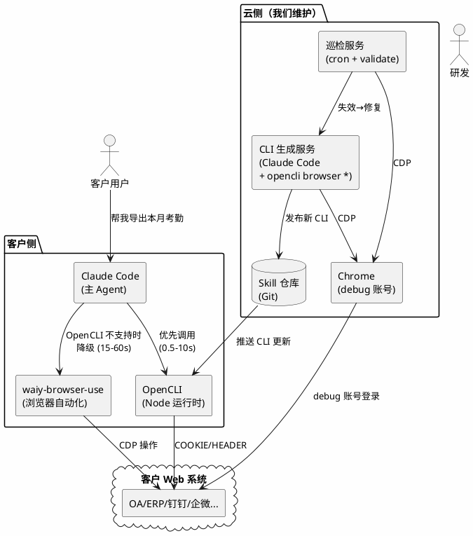
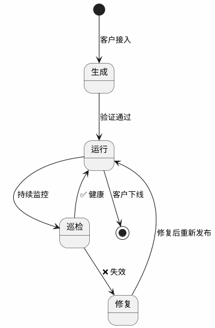
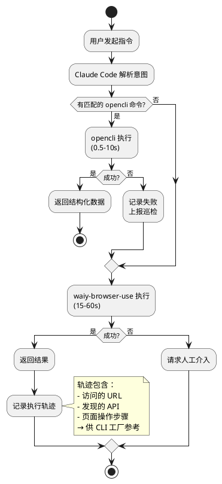

# 办公自动化平台架构设计

> 基于 waiy-browser-use + OpenCLI + Claude Code（主 Agent）的企业办公自动化方案。

---

## 一、先说结论

1. **OpenCLI 已经能用**。154 个站点适配器，PUBLIC 策略的 CLI 实测 0.4-1.3 秒返回结构化数据，`validate` 校验 0.35 秒。
2. **explore / generate 不是内置命令**，它们是 AI Agent 的工作流（skill），本质是"用 Agent 驱动 `opencli browser *` 原语完成 API 发现和适配器编写"。
3. **Claude Code 可以直接作为主 Agent**。以 Skill 形式提供给客户，客户在 Claude Code 中调用。
4. **一个客户的接入，核心工作量在 CLI 生成和验证**，巡检和推送是自动化的。

---

## 二、搞清楚几个关键概念

### 2.1 explore、generate、适配器 的关系

先说适配器是什么。打开 `clis/npm/search.js`，这就是一个适配器：

```javascript
cli({
    site: 'npm',
    name: 'search',
    strategy: Strategy.PUBLIC,   // 公开 API，无需浏览器
    browser: false,
    args: [
        { name: 'query', positional: true, required: true },
        { name: 'limit', type: 'int', default: 20 },
    ],
    columns: ['rank', 'name', 'version', 'description', 'weeklyDownloads', ...],
    func: async (args) => {
        const url = `https://registry.npmjs.org/-/v1/search?text=${query}&size=${limit}`;
        const body = await npmFetch(url, 'npm search');
        return objects.map((obj, i) => ({ rank: i + 1, name: pkg.name, ... }));
    },
});
```

它做了三件事：声明参数、调 API、格式化输出。执行效果：

```bash
$ opencli npm search react -f json --limit 3
# 0.6 秒返回结构化 JSON
[
  { "rank": 1, "name": "react", "version": "19.2.7", "weeklyDownloads": 138394378, ... },
  { "rank": 2, "name": "react-is", ... },
  { "rank": 3, "name": "react-smooth", ... }
]
```

**那 explore 和 generate 是什么？**

它们**不是 OpenCLI 的内置命令**，而是 AI Agent 的工作流——具体在 `skills/opencli-adapter-author/SKILL.md` 中定义。流程如下：

```
AI Agent（如 Claude Code）
    │
    ├── 1. 用 opencli browser open <url> 打开目标网页
    ├── 2. 用 opencli browser network capture-start 开始抓包
    ├── 3. 在页面上操作（点击、搜索等）
    ├── 4. 用 opencli browser network capture-read 读取请求
    ├── 5. 分析哪些是 JSON API，哪些需要 Cookie
    ├── 6. 写 clis/<site>/<name>.js 适配器文件
    ├── 7. 用 opencli validate <site> 校验
    └── 8. 用 opencli browser verify <site> <command> 验证
```

所以 **explore/generate 的本质是 Agent 操作 OpenCLI 的一系列原语**。PDF 文档里写的 `opencli explore <url>` 和 `opencli generate <url>` 是对这个工作流的封装，实际底层调用的还是 `opencli browser *` 命令族。

这意味着：**生成 CLI 适配器必须有 AI Agent 参与**（Claude Code 或类似）。这不是跑一个命令就完事的。

### 2.2 五级认证策略

这是决定一个 CLI 怎么实现的核心：

| 策略 | 实现方式 | 耗时 | 例子 |
|------|---------|------|------|
| **PUBLIC** | 直接 fetch API，不要浏览器 | ~0.5s | npm、PyPI、HackerNews |
| **COOKIE** | 在浏览器中 fetch，带用户 Cookie | ~7s | 知乎、B站、钉钉后台 |
| **HEADER** | 从 Cookie 提取 CSRF Token 加到请求头 | ~7s | Twitter GraphQL |
| **INTERCEPT** | 拦截 XHR/Fetch 获取签名参数 | ~10s | 小红书 |
| **UI** | 直接操作 DOM，最后手段 | ~15s+ | 遗留网站 |

**客户的 OA/ERP/钉钉/企微**，绝大多数走 COOKIE 或 HEADER 策略。因为这些系统的前端操作背后都有 JSON API，只需要登录态。

---

## 三、实测数据

在沙箱环境中对 OpenCLI 的 PUBLIC 策略 CLI 进行了实测：

| 测试项 | 命令 | 耗时 | 结果 |
|--------|------|------|------|
| npm 搜索 | `opencli npm search react --limit 3` | **0.60s** | ✅ 3 条结构化结果 |
| npm 包信息 | `opencli npm package lodash` | **0.43s** | ✅ 元数据完整 |
| PyPI 包信息 | `opencli pypi package requests` | **0.46s** | ✅ 元数据完整 |
| crates 搜索 | `opencli crates search serde --limit 2` | **1.29s** | ✅ 2 条结果 |
| 适配器校验 | `opencli validate npm` | **0.35s** | ✅ 3 命令全通过 |
| 适配器校验 | `opencli validate pypi` | **0.35s** | ✅ 2 命令全通过 |

**结论**：PUBLIC 策略 CLI 的执行稳定在 **0.4-1.3 秒**。COOKIE 策略因为需要启动浏览器，预计 **5-10 秒**。相比 waiy-browser-use 的 **15-60 秒**（每步需要截图 + LLM 推理），OpenCLI 快一个数量级。

---

## 四、整体架构

### 4.1 一句话描述

Claude Code 作为主 Agent 接收用户指令，优先用 OpenCLI 执行（快、稳），不行就用 waiy-browser-use 兜底（慢但通用）。云侧有个服务负责生成和维护 CLI 适配器。

### 4.2 架构图



### 4.3 这个 Skill 是什么形式？

产品经理问的"给客户提供什么形式"，答案是 **Claude Code 的 Skill（`.claude/skills/`）**。

具体说：我们给客户的 Claude Code 环境配一个 skill，比如 `office-automation`，这个 skill 告诉 Claude Code：

```markdown
# office-automation skill

你可以使用 opencli 命令操作客户的办公系统。

## 可用命令

### 钉钉
- `opencli dingtalk attendance --date-from 2026-06-01 --date-to 2026-06-13`
  导出考勤数据
- `opencli dingtalk send-message --group "行政群" --content "..."`
  发送群消息

### ERP（金蝶）
- `opencli kingdee voucher-list --period 202606`
  查询凭证列表
- `opencli kingdee ap-aging`
  应付账龄分析

## 使用规则
1. 优先使用 opencli 命令
2. 如果 opencli 命令不存在或执行失败，使用 waiy-browser-use 操作网页
3. 需要登录时使用已保存的 Cookie（自动注入）
```

**这个 skill 不是一次性完成的**。流程如下：

### 4.4 客户接入的完整过程

以"钉钉考勤导出"为例，一步步说清楚：

**第一步：拿到 debug 账号（1 天）**

客户提供钉钉管理后台的 debug 账号密码。我们在云侧 Chrome 里登录，确认能访问考勤页面。

**第二步：生成 CLI 适配器（2-4 小时/个系统）**

研发（或 AI Agent）在 Claude Code 里操作：

```bash
# 1. 用 OpenCLI 浏览器原语打开钉钉后台
opencli browser open "https://oa.dingtalk.com/attendance/list"

# 2. 开始抓包
opencli browser network capture-start

# 3. 在页面上操作（选日期、点查询、翻页）
opencli browser click "查询按钮的选择器"

# 4. 读取抓到的网络请求
opencli browser network capture-read
# 输出：发现 POST /api/attendance/list 返回 JSON，需要 Cookie 认证

# 5. 分析 API 结构，写适配器
# AI Agent 自动生成 clis/dingtalk/attendance.js：
```

生成的适配器长这样：

```javascript
cli({
    site: 'dingtalk',
    name: 'attendance',
    strategy: Strategy.COOKIE,    // 需要登录态
    browser: true,                // 需要浏览器（注入 Cookie）
    args: [
        { name: 'date-from', required: true, help: '开始日期 YYYY-MM-DD' },
        { name: 'date-to', required: true, help: '结束日期 YYYY-MM-DD' },
        { name: 'department', help: '部门名称，默认全部' },
    ],
    columns: ['name', 'date', 'clockIn', 'clockOut', 'status', 'workHours'],
    pipeline: [
        { navigate: 'https://oa.dingtalk.com/attendance/list' },
        { evaluate: `
            // 在页面中 fetch 考勤 API
            const resp = await fetch('/api/attendance/list', {
                method: 'POST',
                headers: { 'Content-Type': 'application/json' },
                body: JSON.stringify({ dateFrom: '$date-from', dateTo: '$date-to' }),
                credentials: 'include',  // 带上 Cookie
            });
            return await resp.json();
        `},
        { map: 'data.list' },
        { map: row => ({
            name: row.userName,
            date: row.workDate,
            clockIn: row.checkInTime,
            clockOut: row.checkOutTime,
            status: row.status === 1 ? '正常' : '异常',
            workHours: row.workHours,
        })},
    ],
});
```

**第三步：验证（30 分钟）**

```bash
# 校验适配器定义是否合法
opencli validate dingtalk
# ✅ PASS, 1 command(s), Errors: 0

# 用真实 Cookie 跑一次
opencli dingtalk attendance --date-from 2026-06-01 --date-to 2026-06-13
# ✅ 返回考勤数据，与页面核对一致
```

**第四步：发布到 Skill 仓库（自动）**

```bash
# 提交到 Git，打版本号
git add clis/dingtalk/
git commit -m "feat(dingtalk): add attendance CLI"
git tag dingtalk-v1.0.0
git push
```

**第五步：推送到客户端（自动/手动）**

客户侧的 OpenCLI 运行环境定期或手动拉取更新：

```bash
# 客户侧
opencli plugin update dingtalk
# 或者 rsync/scp 增量推送
```

**第六步：用户使用**

用户在 Claude Code 里说"帮我导出本月考勤"，Claude Code 读到 skill 后知道该调：

```bash
opencli dingtalk attendance --date-from 2026-06-01 --date-to 2026-06-13 -f json
```

7 秒返回结果。如果 CLI 不存在（比如用户说"帮我预定会议室"），Claude Code 降级调 waiy-browser-use 操作页面。

---

## 五、CLI 全生命周期管理

这是我们的核心壁垒。不是生成一次就完事，而是持续维护。

### 5.1 生命周期



### 5.2 生成阶段

**谁来做**：Claude Code（或研发手动）驱动 `opencli browser *` 原语。

**过程**：打开网页 → 抓包 → 分析 API → 写适配器 → 验证。

**耗时预估**：

| 场景 | 耗时 | 说明 |
|------|------|------|
| 一个 API 接口的 CLI | 30 分钟-2 小时 | API 清晰、认证简单（COOKIE） |
| 一个系统的全部 CLI（10-30 个接口） | 1-2 天 | 包括 API 发现、认证分析、全部适配器编写和验证 |
| 一个客户的全部系统（3-5 个系统） | 4-6 天 | 包括账号对接、各系统 CLI 生成、整体验证 |

**常见的坑**：

| 坑 | 表现 | 解决办法 |
|----|------|---------|
| API 有签名参数 | 直接 fetch 返回 403 | 用 INTERCEPT 策略拦截请求 |
| 登录态频繁过期 | CLI 跑了几小时后 401 | 定时刷新 Cookie（每 4 小时访问一次页面） |
| 前端渲染无 API | Network 里全是静态资源，没有 JSON | 降级为 UI 策略（DOM 提取），或用 waiy-browser-use |
| CSRF Token 在 meta 标签里 | fetch 需要额外 header | HEADER 策略，先提取 Token 再 fetch |
| 分页逻辑不统一 | 有的是 page/size，有的是 cursor | 适配器里逐个处理，无法统一 |

### 5.3 巡检阶段

**谁来做**：cron 定时任务，自动运行。

**做什么**：每天/每周执行所有 CLI 一次，检查是否还正常。

```bash
#!/bin/bash
# patrol.sh — 每日巡检脚本
SITES="dingtalk kingdee oa-system"

for site in $SITES; do
    # 1. 校验定义
    result=$(opencli validate $site 2>&1)
    if [ $? -ne 0 ]; then
        echo "❌ $site validate failed: $result"
        # 发送告警
        continue
    fi

    # 2. 执行一次（dry-run，只取前 3 条验证能跑通）
    commands=$(opencli $site --help 2>&1 | grep -oP '^\s+\K\w+(?=\s)')
    for cmd in $commands; do
        result=$(timeout 30 opencli $site $cmd --limit 3 -f json 2>&1)
        exit_code=$?
        if [ $exit_code -ne 0 ]; then
            echo "❌ $site $cmd failed (exit=$exit_code): $result"
            # 触发修复流程
        else
            echo "✅ $site $cmd OK"
        fi
    done
done
```

**频率建议**：

| 巡检项 | 频率 | 理由 |
|--------|------|------|
| 接口可达性（能不能跑通） | 每天 | 登录态过期、接口下线都能及时发现 |
| 数据结构一致性（返回字段有没有变） | 每周 | 字段变化通常伴随版本发布，不会每天变 |
| 全量回归（所有命令 + 参数组合） | 每月 | 全面但耗时，低频即可 |

### 5.4 修复阶段

**触发条件**：巡检发现 CLI 失效。

**修复过程**：

1. **诊断**：是登录态过期（401）？API 路径变了（404）？参数变了（400）？数据结构变了（字段缺失）？
2. **自动修复**：
   - 登录态过期 → 重新用 debug 账号登录，刷新 Cookie
   - 数据结构变化 → 重新抓包，对比新旧 JSON 结构，更新 `columns` 和 `map`
3. **半自动修复**：
   - API 路径变了 → Claude Code 重新 explore 页面，发现新 API，更新适配器
4. **人工修复**：
   - 整个前端重构 → 需要重新走一遍生成流程

**修复耗时**：

| 问题类型 | 修复耗时 | 自动化程度 |
|---------|---------|-----------|
| 登录态过期 | 1 分钟 | 全自动 |
| 字段名变化 | 10-30 分钟 | 半自动（Agent 辅助） |
| API 路径变化 | 30 分钟-1 小时 | 半自动 |
| 前端重构 | 2-4 小时 | 手动 + Agent |

### 5.5 推送阶段

推送是低频动作（客户系统不会天天改版）。

**推送方式**：

| 方式 | 适用场景 | 客户体验 |
|------|---------|---------|
| Git pull | 客户有 Node 环境 | `opencli plugin update` 一键更新 |
| 文件同步（rsync/scp） | 简单直接 | 运维操作，用户无感 |
| 包分发（npm private registry） | 多客户统一管理 | `npm update @customer/opencli-skills` |

---

## 六、技术架构细节

### 6.1 Claude Code 作为主 Agent 的工作方式

不需要自己造主 Agent。Claude Code 本身就是一个强大的 Agent，它能：

- 理解自然语言指令
- 调用 Bash 执行 `opencli` 命令
- 读取命令输出，做后续处理（汇总、分析、生成报表）
- 调用 waiy-browser-use 的 Python API 作为降级路径

**Skill 的形式**就是一个 `.claude/skills/office-automation.md` 文件，告诉 Claude Code 有哪些 `opencli` 命令可用、怎么用、什么时候该降级。

### 6.2 一次完整的用户交互

用户说："帮我导出本月钉钉考勤，标记异常的人"

Claude Code 的执行过程：

```
1. 理解意图：导出考勤 + 标记异常
2. 读取 skill：发现有 opencli dingtalk attendance
3. 执行命令：
   $ opencli dingtalk attendance \
       --date-from 2026-06-01 --date-to 2026-06-13 -f json
   # 7 秒返回 JSON 数据
4. 用 Python/pandas 处理数据：
   - 筛选 status="异常" 的记录
   - 按人汇总异常天数
5. 返回给用户：
   "本月共 3 人考勤异常：
    - 张三：迟到 2 次（6/3, 6/7）
    - 李四：早退 1 次（6/10）
    - 王五：缺卡 1 次（6/12）"
```

如果用户说的是 CLI 没有覆盖的操作（比如"帮我在 OA 上提交一个请假申请"），Claude Code 降级：

```
1. 理解意图：提交请假申请
2. 读取 skill：没有 opencli oa submit-leave 命令
3. 降级到 waiy-browser-use：
   agent = Agent(
       task="在 OA 系统提交请假申请：6月15日-6月16日，事假",
       llm=llm,
       browser=browser_session,  # 已注入登录态
   )
   await agent.run(max_steps=20)
   # 30-60 秒完成
4. 返回给用户："请假申请已提交，等待审批"
5. 记录执行轨迹 → 研发后续根据轨迹生成 CLI
```

### 6.3 OpenCLI 与 waiy-browser-use 的关系

| 维度 | OpenCLI | waiy-browser-use |
|------|---------|-----------------|
| 速度 | 0.5-10s | 15-60s |
| 可靠性 | 高（固定 API 调用） | 中（依赖页面结构 + LLM 判断） |
| 覆盖范围 | 低（需要预先生成适配器） | 高（任何网页都能操作） |
| 成本 | 低（无 LLM 调用） | 高（每步需要 LLM 推理 + 截图） |
| 适用场景 | 高频、重复、结构化的操作 | 低频、一次性、复杂交互 |

**协作模式**：OpenCLI 是"固定路线的公交车"，waiy-browser-use 是"出租车"。能走公交就走公交（快、便宜、准时），走不了再打车。

而且打车的记录（waiy-browser-use 的执行轨迹）可以反馈给 CLI 工厂，用来生成新的"公交路线"（CLI 适配器）。这就是 **Skill 自进化**：用得越多，CLI 覆盖越广，降级越少。



---

## 七、云侧 CLI 生成服务

### 7.1 Chrome 实例与 debug 账号

客户给我们一个 debug 账号，我们在云侧维护一个 Chrome 实例：

```
Chrome 实例
├── Profile: customer-A
│   ├── Tab 1: 钉钉后台 (已登录)
│   ├── Tab 2: 金蝶 ERP (已登录)
│   └── Tab 3: OA 系统 (已登录)
└── Cookie Store: encrypted at rest
```

**登录态管理**：

| 问题 | 方案 | 频率 |
|------|------|------|
| Session 过期 | 定时访问目标页面，刷新 Cookie | 每 4 小时 |
| Cookie 过期 | 用账号密码重新登录 | 按需（告警触发） |
| 验证码/短信 | 通知研发手动处理 | 极少（debug 账号通常免验证码） |

### 7.2 生成流程实操

以钉钉考勤为例，完整的操作记录：

```bash
# 1. 打开钉钉后台考勤页面
$ opencli browser open "https://oa.dingtalk.com/attendance/list" \
    --keep-tab true --window foreground
# 耗时：3-5s（页面加载）

# 2. 开始抓包
$ opencli browser network capture-start
# 耗时：<1s

# 3. 在页面上操作——选日期、点查询
$ opencli browser click "#date-picker"
$ opencli browser type "#date-picker" "2026-06-01"
$ opencli browser click "#search-btn"
# 耗时：5-10s

# 4. 读取网络请求
$ opencli browser network capture-read -f json
# 输出类似：
# [
#   { "url": "/api/attendance/list", "method": "POST",
#     "status": 200, "contentType": "application/json",
#     "requestHeaders": { "Cookie": "...", "X-CSRF-Token": "..." },
#     "responseBody": { "data": { "list": [...] } } }
# ]
# 耗时：<1s

# 5. 分析 API，确定策略
# 观察到：需要 Cookie + X-CSRF-Token → 策略是 HEADER

# 6. 写适配器（AI 或手动）
# 创建 clis/dingtalk/attendance.js

# 7. 验证
$ opencli validate dingtalk
# ✅ PASS
$ opencli dingtalk attendance --date-from 2026-06-01 --date-to 2026-06-13
# ✅ 返回数据
```

**总耗时**：30 分钟-2 小时（取决于 API 复杂度和认证方式）。

---

## 八、与现有代码的对应关系

| 架构组件 | 现有代码 | 状态 |
|---------|---------|------|
| 主 Agent | Claude Code 本身 | ✅ 直接使用 |
| OpenCLI 执行引擎 | `src/execution.ts` / HTTP daemon :19825 | ✅ 已有 |
| 浏览器操作原语 | `opencli browser *`（30+ 子命令） | ✅ 已有 |
| 适配器编写 skill | `skills/opencli-adapter-author/SKILL.md` | ✅ 已有 |
| 适配器校验 | `opencli validate` | ✅ 已有 |
| 适配器验证 | `opencli browser verify` | ✅ 已有 |
| BrowserAgent 降级 | `browser_use/agent/service.py` → `Agent.run()` | ✅ 已有 |
| 巡检服务 | 需要新建（cron + shell 脚本） | ❌ 待建 |
| 登录态管理 | 部分有（OpenCLI Cookie 策略） | 🟡 需扩展 |
| Skill 推送分发 | 无 | ❌ 待建 |
| 客户 Skill 配置 | `.claude/skills/` 框架已有 | 🟡 需定制 |

---

## 九、客户接入 checklist

| 步骤 | 耗时 | 产出 | 谁做 |
|------|------|------|------|
| 1. 获取 debug 账号 | 1 天 | 账号密码 + 系统 URL 清单 | 客户 |
| 2. 云侧 Chrome 登录 | 1 小时 | 各系统登录态就绪 | 研发 |
| 3. 逐系统生成 CLI | 1-2 天/系统 | `clis/<site>/*.js` 适配器 | Claude Code + 研发 review |
| 4. 验证全部 CLI | 半天 | `opencli validate` + 实际执行全部通过 | 研发 |
| 5. 编写客户 Skill | 2 小时 | `.claude/skills/office-automation.md` | 研发 |
| 6. 部署到客户端 | 半天 | OpenCLI + Skill 在客户环境跑通 | 研发 + 客户 IT |
| 7. 配置巡检 | 1 小时 | cron 定时任务 | 研发 |
| **总计** | **4-6 天** | 可用的数字员工 | |

---

## 十、MVP 建议

第一个客户的第一个场景："钉钉考勤导出 + 异常标记"。

| 模块 | MVP 范围 | 不做什么 |
|------|---------|---------|
| 主 Agent | Claude Code + 1 个 skill 文件 | 不造新 Agent 框架 |
| CLI 生成 | 手动 Claude Code + opencli browser | 不做全自动 explore |
| CLI 执行 | 直接跑 opencli 命令 | 不做 HTTP daemon |
| 降级路径 | 直接 `Agent.run()` | 不做自动降级路由 |
| 巡检 | cron + shell 脚本 | 不做巡检平台 UI |
| 推送 | rsync 手动同步 | 不做自动分发 |
| 登录态 | 手动维护 Cookie | 不做自动重登 |

**MVP 验证成功后，再逐步自动化每个环节。**
