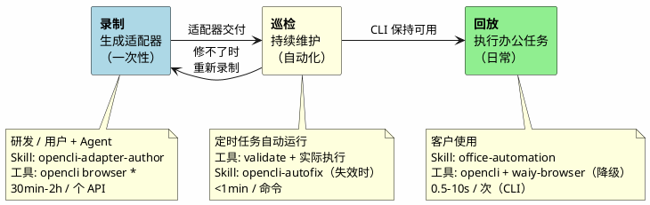
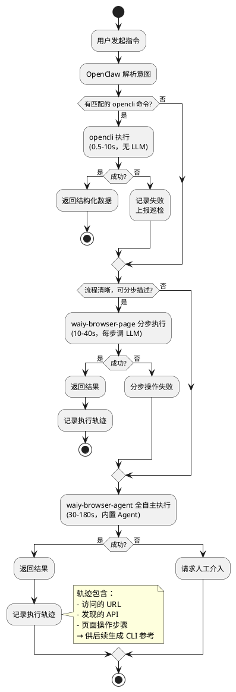
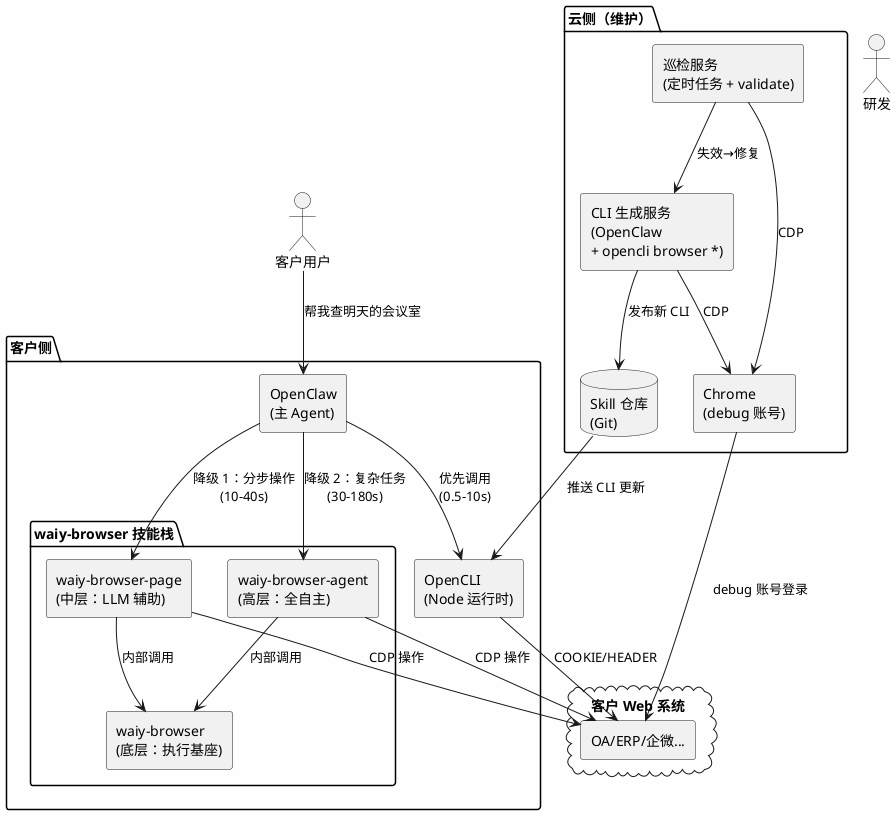
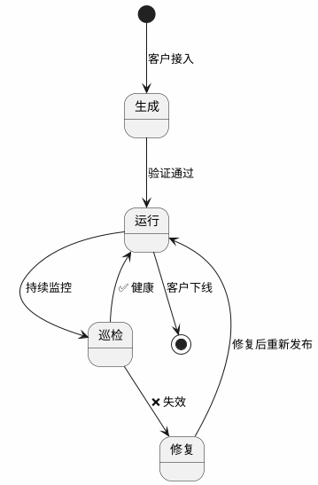

# 办公自动化平台架构设计

> 基于 OpenCLI + waiy-browser + 主 Agent（OpenClaw）的企业办公自动化方案。

---

## 一、目标与范围

### 1.1 要解决什么问题

让企业员工通过自然语言完成日常办公操作，覆盖**读和写**两类任务：

| 类型 | 示例 | 占比（预估） |
|------|------|-------------|
| **读**（查询/提取） | "查下明天 3 楼有哪些会议室可用"、"导出本月考勤" | ~70% |
| **写**（提交/操作） | "帮我预订明天下午 302 会议室"、"提交请假申请" | ~30% |

读操作的特点是**高频、重复、可参数化**——同一个查询每天都有人做，只是参数不同。写操作通常是**表单填写 + 按钮提交**，流程固定但步骤多。

### 1.2 为什么不能只用 GUI Agent

纯 GUI Agent（如 waiy-browser-agent）可以完成上述所有任务，但存在三个问题：

| 问题 | 说明 |
|------|------|
| **慢** | 每个操作 30s-5min，每步都要截图 + LLM 推理。"查个会议室"等 3 分钟，用户体验差 |
| **贵** | 每次执行都调用 LLM，查一次会议室消耗的 token 可能比回答一个复杂问题还多 |
| **不稳定** | LLM 每次推理结果可能不同，多步操作的累积误差导致偶发失败 |

**核心矛盾**：70% 的读操作是高频重复的，每次都让 AI 从头看页面、找元素、点击、提取，是巨大的浪费。

### 1.3 选型思路

| 方案 | 速度 | 成本 | 覆盖范围 | 可靠性 |
|------|------|------|---------|--------|
| **纯 web fetch** | 最快 | 最低 | 极低（需要知道 API） | 高 |
| **OpenCLI**（预置适配器） | 快（0.5-10s） | 低（无 LLM） | 中（需预先生成） | 高 |
| **waiy-browser-page**（LLM 辅助分步操作） | 中（10-40s） | 中（每步调 LLM） | 高（任何网页） | 中 |
| **waiy-browser-agent**（全自主 GUI Agent） | 慢（30-180s） | 高（持续调 LLM） | 最高 | 中低 |

纯 web fetch 最快但不现实——企业系统需要登录态、CSRF Token、签名参数等，不是拼个 URL 就能调的。OpenCLI 把这些复杂性封装成适配器，对外暴露简单的 CLI 接口。

**选型结论**：**OpenCLI 做主力（覆盖已知的高频操作），waiy-browser 做降级（覆盖未知或低频操作）**。两者不是替代关系，而是互补——OpenCLI 的覆盖范围随使用逐步扩大（降级执行的轨迹可以反馈生成新 CLI），最终降级越来越少。

### 1.4 读 vs 写的实现策略

| | 读（查询/提取） | 写（提交/操作） |
|---|---|---|
| **OpenCLI 能覆盖** | `func` 里调 API 返回数据 | `pipeline` 里 navigate + evaluate（调提交 API） |
| **OpenCLI 不能覆盖** | 降级到 `waiy-browser-page page_use_extract` | 降级到 `waiy-browser-page page_use_act` |
| **流程太复杂** | 降级到 `waiy-browser-agent execute_task` | 降级到 `waiy-browser-agent execute_task` |

OpenCLI 不只是"读"。适配器的 `pipeline` 可以执行任意浏览器内操作（包括表单填写和提交），只要 API 存在就能封装。区别在于：读操作通常对应 GET 请求，写操作对应 POST/PUT 请求——但对 OpenCLI 来说都是 `fetch`。

---

## 二、工具与技能全景

在进入具体流程之前，先介绍本方案涉及的所有工具和技能，后续章节会反复引用。

### 2.1 OpenCLI——确定性 CLI 适配器

OpenCLI 把网站操作封装成命令行接口。目前已有 154 个站点适配器。一个适配器的核心结构：

```javascript
cli({
    site: 'alimeeting',
    name: 'rooms',
    strategy: Strategy.COOKIE,    // 认证策略（详见第三章）
    browser: true,
    args: [
        { name: 'date', required: true, help: '日期 YYYY-MM-DD' },
        { name: 'floor', help: '楼层' },
    ],
    columns: ['name', 'floor', 'capacity', 'status'],
    pipeline: [
        { navigate: 'https://meeting.alibaba-inc.com/alimeeting/web#/' },
        { evaluate: `
            const resp = await fetch('/api/meeting/room/list?' + new URLSearchParams({
                date: '$date', floor: '$floor' || ''
            }), { credentials: 'include' });
            return await resp.json();
        `},
        { map: 'data.rooms' },
        { map: room => ({ name: room.roomName, floor: room.floorName, ... }) },
    ],
});
```

**适配器 = 一个网站操作的标准化封装**。声明参数 → 调 API → 格式化输出。写好之后，`opencli <site> <command>` 一行命令调用，不需要知道背后的 API 细节。

### 2.2 waiy-browser 三层架构

waiy-browser 提供三个层级的浏览器自动化能力：

| 层级 | CLI 工具 | 核心命令 | 是否需要 LLM | 单步耗时 | 定位 |
|------|---------|---------|-------------|---------|------|
| **底层** | `waiy-browser` | `snapshot`、`click_element_by_index`、`input_text`、`scroll`、`eval` | 否 | <1s | 确定性浏览器操作 |
| **中层** | `waiy-browser-page` | `page_use_navigate`、`page_use_observe`、`page_use_act`、`page_use_extract` | 是（每步调 LLM） | 5-15s | 自然语言驱动的单页操作 |
| **高层** | `waiy-browser-agent` | `execute_task` | 是（内置 Agent 循环） | 30s-5min | 全自主多步任务 |

**底层**：确定性操作，核心是 `snapshot`（获取页面元素编号）+ `click_element_by_index`（按编号点击）。编号是临时的，每次 snapshot 重新分配，因此只能在 Agent 实时交互时使用（看一步、操作一步），不能写死在脚本里回放。底层同时也是中层和高层的执行基座——`page_use_act` 和 `execute_task` 内部都是调用这些底层命令操作页面。

**中层**：调用者用自然语言描述每步操作意图，LLM 理解页面后执行。适合流程清晰、可分步描述的操作。底层的 page 模块还提供：
- **LoginFlow**：自动检测登录表单（含 iframe）→ 执行登录 → 验证成功
- **PageExtractor**：结构化数据提取 + 自动翻页（带去重），支持 JSON Schema 定义输出格式
- **PageActor**：操作前后 DOM 稳定性检查（元素 hash 对比），确保页面变化符合预期

**高层**：接收一个自然语言任务描述，内置 Agent 自主规划和执行所有步骤。适合流程复杂或不确定的一次性操作。同一时间只能运行一个 `execute_task`，超时至少 600s。

### 2.3 Skill 清单

Skill 是给 AI Agent 看的决策指南（"什么时候做什么、怎么做"），Agent 根据 Skill 的指引调用具体的命令。命令本身不需要 Skill 就能执行。

**录制阶段（生成适配器）用到的 Skill：**

| Skill | 做什么 | 什么时候用 |
|---|---|---|
| `opencli-adapter-author` | **主力**。完整的适配器生成决策树 + runbook | 给新站点写 CLI 时 |
| `opencli-browser` | 浏览器操作手册（`state/find/click/type/network` 等子命令的用法） | adapter-author 过程中驱动浏览器 |
| `opencli-sitemap-author` | 站点地图编写（记录页面结构和导航路径） | 复杂站点需要先摸清页面结构时 |
| `opencli-browser-sitemap` | 站点地图消费（读取已有 sitemap 加速探索） | 有 sitemap 的站点，跳过重复探索 |
| `opencli-usage` | 入门指南（命令总览、策略说明、路由表） | 不知道用什么命令时查 |

**巡检阶段（自动维护）用到的 Skill：**

| Skill | 做什么 | 什么时候用 |
|---|---|---|
| `opencli-autofix` | 自动修复失效适配器（诊断 → 探查 → patch → 重试，最多 3 轮） | 巡检发现 CLI 失效时自动触发 |

**浏览器自动化（waiy-browser 技能栈）：**

| Skill | 层级 | 做什么 | 什么时候用 |
|---|---|---|---|
| `waiy-browser` | 底层 | 确定性浏览器操作 | 录制阶段 Agent 探索网站；page/agent 层的执行基座 |
| `waiy-browser-page` | 中层 | 自然语言单页操作 | 回放降级（分步操作）；结构化数据提取 |
| `waiy-browser-agent` | 高层 | 全自主多步任务执行 | 回放降级（复杂任务兜底） |

**交付给客户的 Skill：**

| Skill | 做什么 |
|---|---|
| `office-automation` | 告诉 OpenClaw 有哪些 opencli 命令可用、怎么调、什么时候降级到 waiy-browser-page / waiy-browser-agent |

客户只看到 `office-automation` 这一个 Skill，不需要接触上面的开发和维护 Skill。

### 2.4 内置命令（不需要 Skill）

| 命令 | 做什么 | 在哪个阶段用 |
|------|--------|-------------|
| `opencli validate <site>` | 校验适配器定义是否合法（语法、字段对齐） | 录制（验证产出）、巡检（定期检查） |
| `opencli browser verify <site> <cmd>` | 用真实 Cookie 执行一次，核对返回数据 | 录制（端到端验证）、巡检（回归测试） |
| `opencli browser analyze <url>` | 分析站点结构，推荐认证策略 | 录制（起步） |
| `opencli browser network capture-*` | 抓包（开始/读取/停止） | 录制（发现 API） |
| `opencli browser state/click/type` | 查看页面元素 / 操作元素 | 录制（Agent 探索页面） |

---

## 三、认证策略

不同网站获取数据的方式不同，OpenCLI 把它分成五级策略。每级策略决定了适配器的实现方式和运行时开销：

| 策略 | 实现方式 | 单次执行耗时 | 典型场景 |
|------|---------|-------------|---------|
| **PUBLIC** | 直接 HTTP 请求公开 API，不需要浏览器 | ~0.5s | npm、PyPI、HackerNews 等公开平台 |
| **COOKIE** | 在浏览器环境中发请求，自动带用户 Cookie | ~7s | 企业 OA、ERP、会议系统等需登录的后台 |
| **HEADER** | 从 Cookie 提取 CSRF Token 加到请求头 | ~7s | Twitter GraphQL 等有 CSRF 保护的 API |
| **INTERCEPT** | 拦截 XHR/Fetch 获取签名参数后重放 | ~10s | 小红书等有请求签名的站点 |
| **UI** | 直接操作 DOM 提取数据（无可用 API） | ~15s+ | 无 JSON API 的遗留系统 |

**客户的办公系统**（OA/ERP/企微/会议系统等），绝大多数走 COOKIE 或 HEADER 策略——这些系统的前端操作背后都有 JSON API，只需要登录态。写操作（提交表单）同样是调 API（POST/PUT），只是请求方法不同。

---

## 四、三个阶段：录制 → 巡检 → 回放

整个流程分三个阶段。前面介绍的工具和 Skill 分别在不同阶段发挥作用：



| | 录制（生成适配器） | 巡检（持续维护） | 回放（执行办公任务） |
|---|---|---|---|
| **谁操作** | 研发或用户 + 主 Agent | 定时任务 + `opencli-autofix` skill | 客户的主 Agent（自动） |
| **频率** | 一次性（每个 API 做一次） | 每天/每周自动执行 | 反复执行（每天/每周） |
| **用的 Skill** | `opencli-adapter-author` | `opencli-autofix`（失效时自动修复） | `office-automation` |
| **核心操作** | `browser analyze/network/init/verify` | `validate` + 实际执行 + 比对 fixture | `opencli <site> <command>` |
| **需要浏览器** | 需要（探索 + 验证） | COOKIE/UI 策略需要 | 看 strategy |
| **产出** | `clis/<site>/<name>.js` 适配器 | 健康报告 / 修复 patch | 结构化数据 |
| **耗时** | 30min-2h / 个 API | 巡检 <1min/命令；修复 1min-4h | 0.5-10s / 次 |

> **录制阶段不一定需要研发**。用户也可以在 OpenClaw 里加载 `opencli-adapter-author` skill，让 Agent 帮你录制。但企业内网系统（OA/ERP）的 API 认证通常比较复杂，建议研发先做，后续简单站点用户可以自助。

### 4.1 巡检具体做什么

1. **每天**：定时任务跑 `opencli validate <site>` 校验适配器定义 + 对每个命令执行一次（取前 3 条数据），确认接口可达、返回非空
2. **每周**：比对返回数据与 fixture（`verify/<cmd>.json`）的结构，检查字段是否变化
3. **失效时**：自动触发 `opencli-autofix` skill——诊断错误类型（401/404/字段缺失）→ 用 `opencli browser` 重新探查 → 自动 patch 适配器 → 重试（最多 3 轮）
4. **修不了时**：告警通知研发手动介入（回到录制阶段重做）

---

## 五、回放阶段的降级路径

客户日常使用时，OpenClaw 按以下优先级执行用户指令：



### 5.1 三级降级对照

| 维度 | OpenCLI | waiy-browser-page（中层） | waiy-browser-agent（高层） |
|------|---------|--------------------------|--------------------------|
| 速度 | 0.5-10s | 10-40s（3-5 步） | 30-180s |
| 可靠性 | 高（固定 API 调用） | 中（LLM 每步推理） | 中低（多步 LLM 累积误差） |
| 覆盖范围 | 低（需预先生成适配器） | 高（任何网页） | 高（任何网页） |
| LLM 成本 | 无 | 每步调一次 LLM | 持续调 LLM（规划 + 执行） |
| 控制粒度 | 精确（参数化 CLI） | 中（调用者分步控制） | 低（只给目标，Agent 自主） |
| 适用场景 | 高频、重复、结构化 | 流程清晰的降级操作 | 复杂/不确定的一次性操作 |

> **底层 `waiy-browser`** 不出现在降级链中——它的 `snapshot` 返回临时元素编号，无法在无人值守场景下独立工作。但它是 page 和 agent 层的执行引擎，间接参与所有降级操作。

### 5.2 降级示例

**查询（读）——没有对应 CLI 时：**

```bash
# 用 waiy-browser-page 分步提取
waiy-browser-page page_use_navigate "https://oa.company.com/attendance"
waiy-browser-page page_use_extract "提取本月考勤记录" \
  --field-schema '{"type": "array", "items": {"type": "object", "properties": {"date": {"type": "string"}, "status": {"type": "string"}}}}'
# 总耗时 15-30s
```

**操作（写）——没有对应 CLI 时：**

```bash
# 方式 A：waiy-browser-page 分步操作（流程清晰时）
waiy-browser-page page_use_navigate "https://oa.company.com/leave"
waiy-browser-page page_use_act "点击'申请请假'按钮"
waiy-browser-page page_use_act "选择请假类型为'事假'，填写开始日期 2026-06-15，结束日期 2026-06-16"
waiy-browser-page page_use_act "点击提交按钮"
# 总耗时 20-40s

# 方式 B：waiy-browser-agent 全自主执行（流程复杂时）
waiy-browser-agent execute_task \
  "打开 OA 系统 https://oa.company.com/leave，提交请假申请：6月15日-6月16日，事假" \
  --timeout 600
# 总耗时 30-180s
```

### 5.3 Skill 自进化

降级执行的轨迹（访问的 URL、发现的 API、操作步骤）会被记录下来，供后续生成新的 CLI 适配器参考。**用得越多，CLI 覆盖越广，降级越少**。

---

## 六、实测数据

### 6.1 沙箱环境实测（4C8G / 5Mbps 带宽）

在云端沙箱环境（4C8G Ubuntu，5Mbps 出口带宽）中对 PUBLIC 策略 CLI 进行了实测：

| 测试项 | 命令 | 沙箱耗时 | 本地推算* | 结果 |
|--------|------|----------|----------|------|
| npm 搜索 | `opencli npm search react --limit 3` | **0.60s** | ~0.25s | ✅ 3 条结构化结果 |
| npm 包信息 | `opencli npm package lodash` | **0.43s** | ~0.18s | ✅ 元数据完整 |
| PyPI 包信息 | `opencli pypi package requests` | **0.46s** | ~0.20s | ✅ 元数据完整 |
| crates 搜索 | `opencli crates search serde --limit 2` | **1.29s** | ~0.55s | ✅ 2 条结果 |
| 适配器校验 | `opencli validate npm` | **0.35s** | ~0.30s | ✅ 3 命令全通过 |
| 适配器校验 | `opencli validate pypi` | **0.35s** | ~0.30s | ✅ 2 命令全通过 |

> \* 本地推算基于 Apple M2 Pro 32G + 100Mbps 网络环境。PUBLIC 策略主要耗时在网络延迟（API 请求），本地 100Mbps 网络的 RTT 通常比沙箱 5Mbps 低 50-60%。

### 6.2 各执行方式耗时对照

下表对比的是**单次用户任务的端到端耗时**（从发起请求到拿到结果）：

| 执行方式 | 沙箱（4C8G / 5Mbps） | 本地（M2 Pro / 100Mbps） | 耗时因素 | 需要 LLM |
|---------|----------------------|--------------------------|---------|----------|
| **OpenCLI PUBLIC** | 0.4-1.3s | 0.2-0.6s | 网络 RTT | 否 |
| **OpenCLI COOKIE** | 7-12s | 5-8s | 浏览器启动 + 页面加载 | 否 |
| **OpenCLI INTERCEPT** | 10-15s | 8-12s | 页面加载 + 等待 XHR | 否 |
| **OpenCLI UI** | 15-25s | 12-20s | DOM 渲染 + 元素操作 | 否 |
| **waiy-browser-page**（降级 1） | 20-60s | 10-40s | 每步 LLM 推理（3-5 步） | 是（每步） |
| **waiy-browser-agent**（降级 2） | 60-300s | 30-180s | 多步 Agent 循环 + LLM | 是（持续） |

OpenCLI 比 waiy-browser-page 快一个数量级，比 waiy-browser-agent 快两个数量级。降级层的 LLM 调用是主要成本来源。客户实际部署的镜像环境（4C8G + 5Mbps）中，OpenCLI 的 COOKIE 策略（大部分企业系统）7-12s 返回，用户体验可接受。

---

## 七、整体架构

OpenClaw 作为主 Agent 接收用户指令，优先用 OpenCLI 执行（快、稳、无 LLM 成本），不行就降级到 waiy-browser-page（LLM 辅助按步操作），最后兜底用 waiy-browser-agent（全自主）。云侧有个服务负责生成和维护 CLI 适配器。



---

## 八、交付形式

交付给客户的是一个 **OpenClaw 的 Skill 文件**（`.claude/skills/office-automation.md`），告诉 OpenClaw 有哪些命令可用、怎么用、什么时候降级：

```markdown
# office-automation skill

你可以使用 opencli 命令操作客户的办公系统。

## 可用命令

### 阿里会议（alimeeting）
- `opencli alimeeting rooms --date 2026-06-15 --floor 3F`
  查询可用会议室
- `opencli alimeeting book --room 302 --date 2026-06-15 --start 14:00 --end 15:00`
  预订会议室
- `opencli alimeeting my-bookings --date 2026-06-15`
  查看我的预订

### ERP（金蝶）
- `opencli kingdee voucher-list --period 202606`
  查询凭证列表
- `opencli kingdee ap-aging`
  应付账龄分析

### OA 系统
- `opencli oa leave-list --month 2026-06`
  查询请假记录

## 使用规则
1. 优先使用 opencli 命令（快、稳、无 LLM 成本）
2. 如果没有对应命令或执行失败，流程清晰时用 waiy-browser-page 分步操作
3. 流程复杂或不确定时，用 waiy-browser-agent 全自主执行
4. 需要登录时使用已保存的 Cookie（自动注入），LoginFlow 可自动处理登录表单
```

这个 Skill 不是一次性写完的——每录制一个新的 CLI 适配器，就在 Skill 里增加对应的命令说明。

---

## 九、客户接入的完整过程

以"阿里会议室预订查询"为例（`https://meeting.alibaba-inc.com/alimeeting/web#/`）：

**第一步：拿到 debug 账号（1 天）**

客户提供阿里内网会议系统的 debug 账号。在云侧 Chrome 里登录，确认能访问会议室页面。

**第二步：生成 CLI 适配器（2-4 小时/个系统）**

这是**录制阶段**。在 OpenClaw 里加载 `opencli-adapter-author` skill，让 Agent 驱动整个过程：

```bash
# 1. 分析站点结构，推荐认证策略
opencli browser analyze "https://meeting.alibaba-inc.com/alimeeting/web#/" \
    --trace on --keep-tab true --window foreground
# 输出：Pattern B（SPA + 内部 API），推荐 COOKIE_API 策略

# 2. 抓包
opencli browser network capture-start

# 3. Agent 通过 opencli browser state 拿到页面元素编号，精确操作
opencli browser state
# 输出：[1] 日期选择器  [2] 楼层下拉  [3] 查询按钮  ...
opencli browser click "[3]"
# <1s，确定性操作

# 4. 读取网络请求，发现 API
opencli browser network capture-read -f json
# 输出：发现 GET /api/meeting/room/list?date=...&floor=... 返回 JSON

# 5. Agent 分析 API 结构，生成适配器骨架
opencli browser init alimeeting/rooms

# 6. Agent 编写适配器代码（见第二章适配器结构）
```

**第三步：验证（30 分钟）**

```bash
# 校验适配器定义是否合法
opencli validate alimeeting
# ✅ PASS, 1 command(s), Errors: 0

# 用真实 Cookie 执行一次，核对返回数据与页面一致
opencli alimeeting rooms --date 2026-06-15 --floor 3F
# ✅ 返回会议室列表

# 生成回归基准
opencli browser verify alimeeting rooms --write-fixture
# ✅ 写入 ~/.opencli/sites/alimeeting/verify/rooms.json
```

**第四步：发布到 Skill 仓库（自动）**

```bash
git add clis/alimeeting/
git commit -m "feat(alimeeting): add room query CLI"
git push
```

**第五步：推送到客户端（自动/手动）**

```bash
opencli plugin update alimeeting
# 或 rsync/scp 增量推送
```

**第六步：用户使用（回放阶段）**

用户在 OpenClaw 里说"帮我查下明天 3 楼有哪些会议室可以用"，OpenClaw 读到 Skill 后调用：

```bash
opencli alimeeting rooms --date 2026-06-15 --floor 3F -f json
```

5-8 秒返回结果。如果用户说"帮我预订明天下午 2 点 3 楼的 302 会议室"，而还没有 `alimeeting book` 这个 CLI，OpenClaw 降级——流程简单就用 `waiy-browser-page` 分步操作（navigate → act "点击 302 会议室" → act "选择 14:00" → act "确认预订"），流程复杂就交给 `waiy-browser-agent execute_task` 全自主完成。

---

## 十、CLI 全生命周期管理

不是生成一次就完事，持续维护是核心壁垒。

### 10.1 生命周期状态图



### 10.2 生成阶段

**谁来做**：OpenClaw（研发或用户均可）驱动 `opencli browser *` 系列命令。

**耗时预估**：

| 场景 | 耗时 | 说明 |
|------|------|------|
| 一个 API 接口的 CLI | 30 分钟-2 小时 | API 清晰、认证简单（COOKIE） |
| 一个系统的全部 CLI（10-30 个接口） | 1-2 天 | 包括 API 发现、认证分析、全部适配器编写和验证 |
| 一个客户的全部系统（3-5 个系统） | 4-6 天 | 包括账号对接、各系统 CLI 生成、整体验证 |

**常见的坑**：

| 问题 | 表现 | 解决办法 |
|----|------|---------|
| API 有签名参数 | 直接 fetch 返回 403 | 用 INTERCEPT 策略拦截请求 |
| 登录态频繁过期 | CLI 跑了几小时后 401 | 定时刷新 Cookie（每 4 小时访问一次页面） |
| 前端渲染无 API | Network 里全是静态资源，没有 JSON | 降级为 UI 策略（DOM 提取），或用 waiy-browser-page |
| CSRF Token 在 meta 标签里 | fetch 需要额外 header | HEADER 策略，先提取 Token 再 fetch |
| 分页逻辑不统一 | 有的是 page/size，有的是 cursor | 适配器里逐个处理，无法统一 |

### 10.3 巡检阶段

**谁来做**：定时任务，自动运行。

```bash
#!/bin/bash
# patrol.sh — 每日巡检脚本
SITES="alimeeting kingdee oa-system"

for site in $SITES; do
    # 1. 校验定义
    result=$(opencli validate $site 2>&1)
    if [ $? -ne 0 ]; then
        echo "❌ $site validate failed: $result"
        continue
    fi

    # 2. 执行一次（取前 3 条验证能跑通）
    commands=$(opencli $site --help 2>&1 | grep -oP '^\s+\K\w+(?=\s)')
    for cmd in $commands; do
        result=$(timeout 30 opencli $site $cmd --limit 3 -f json 2>&1)
        exit_code=$?
        if [ $exit_code -ne 0 ]; then
            echo "❌ $site $cmd failed (exit=$exit_code): $result"
            # 触发 opencli-autofix skill
        else
            echo "✅ $site $cmd OK"
        fi
    done
done
```

**频率建议**：

| 巡检项 | 频率 | 理由 |
|--------|------|------|
| 接口可达性（能不能跑通） | 每天 | 登录态过期、接口下线都能及时发现 |
| 数据结构一致性（返回字段有没有变） | 每周 | 字段变化通常伴随版本发布，不会每天变 |
| 全量回归（所有命令 + 参数组合） | 每月 | 全面但耗时，低频即可 |

### 10.4 修复阶段

**修复过程**：

1. **诊断**：登录态过期（401）？API 路径变了（404）？参数变了（400）？数据结构变了（字段缺失）？
2. **自动修复**：登录态过期 → 重新登录刷新 Cookie；数据结构变化 → 重新抓包更新 `columns` 和 `map`
3. **半自动修复**：API 路径变了 → OpenClaw 重新探索页面，发现新 API，更新适配器
4. **人工修复**：整个前端重构 → 重新走一遍生成流程

| 问题类型 | 修复耗时 | 自动化程度 |
|---------|---------|-----------|
| 登录态过期 | 1 分钟 | 全自动 |
| 字段名变化 | 10-30 分钟 | 半自动（Agent 辅助） |
| API 路径变化 | 30 分钟-1 小时 | 半自动 |
| 前端重构 | 2-4 小时 | 手动 + Agent |

### 10.5 推送阶段

| 方式 | 适用场景 | 客户体验 |
|------|---------|---------|
| Git pull | 客户有 Node 环境 | `opencli plugin update` 一键更新 |
| 文件同步（rsync/scp） | 简单直接 | 运维操作，用户无感 |
| 包分发（npm private registry） | 多客户统一管理 | `npm update @customer/opencli-skills` |

---

## 十一、云侧 CLI 生成服务

### 11.1 Chrome 实例与 debug 账号

客户给一个 debug 账号，云侧维护一个 Chrome 实例：

```
Chrome 实例
├── Profile: customer-A
│   ├── Tab 1: 阿里会议 (已登录)
│   ├── Tab 2: 金蝶 ERP (已登录)
│   └── Tab 3: OA 系统 (已登录)
└── Cookie Store: encrypted at rest
```

**登录态管理**：

| 问题 | 方案 | 频率 |
|------|------|------|
| Session 过期 | 定时访问目标页面，刷新 Cookie | 每 4 小时 |
| Cookie 过期 | 用账号密码重新登录 | 按需（告警触发） |
| 验证码/短信 | 通知研发手动处理 | 极少（debug 账号通常免验证码） |

### 11.2 生成流程补充

- 整个录制过程是 AI Agent 操作，不是人手动点。Agent 加载 `opencli-adapter-author` skill 后，按 SKILL.md 里的决策树 + runbook 自动执行 `opencli browser *` 命令。研发的角色是发起任务 + review 产出。
- `opencli browser state` 查看页面元素（带编号），`opencli browser click "[3]"` 精确点击——确定性操作，不依赖 LLM 看截图判断。
- 总耗时：30 分钟-2 小时/个 API（取决于 API 复杂度和认证方式）。

---

## 十二、与现有代码的对应关系

| 架构组件 | 现有代码 | 状态 |
|---------|---------|------|
| 主 Agent | OpenClaw | ✅ 直接使用 |
| OpenCLI 执行引擎 | `src/execution.ts` / HTTP daemon :19825 | ✅ 已有 |
| 浏览器操作命令 | `opencli browser *`（30+ 子命令） | ✅ 已有 |
| 适配器编写 skill | `skills/opencli-adapter-author/SKILL.md` | ✅ 已有 |
| 适配器校验 | `opencli validate` | ✅ 已有 |
| 适配器验证 | `opencli browser verify` | ✅ 已有 |
| 降级层 1：分步操作 | `waiy-browser-page page_use_*` | ✅ 已有 |
| 降级层 2：全自主 | `waiy-browser-agent execute_task` | ✅ 已有 |
| 底层执行引擎 | `waiy-browser snapshot/click/input` | ✅ 已有 |
| 自动登录 | `browser_use/page/login_flow.py` → `LoginFlow` | ✅ 已有 |
| 结构化提取+翻页 | `browser_use/page/extractor.py` → `PageExtractor` | ✅ 已有 |
| 巡检服务 | 需要新建（定时任务 + shell 脚本） | ❌ 待建 |
| 登录态管理 | 部分有（OpenCLI Cookie 策略） | 🟡 需扩展 |
| Skill 推送分发 | 无 | ❌ 待建 |
| 客户 Skill 配置 | `.claude/skills/` 框架已有 | 🟡 需定制 |

---

## 十三、客户接入 checklist

| 步骤 | 耗时 | 产出 | 谁做 |
|------|------|------|------|
| 1. 获取 debug 账号 | 1 天 | 账号密码 + 系统 URL 清单 | 客户 |
| 2. 云侧 Chrome 登录 | 1 小时 | 各系统登录态就绪 | 研发 |
| 3. 逐系统生成 CLI | 1-2 天/系统 | `clis/<site>/*.js` 适配器 | OpenClaw + 研发 review |
| 4. 验证全部 CLI | 半天 | `opencli validate` + 实际执行全部通过 | 研发 |
| 5. 编写客户 Skill | 2 小时 | `.claude/skills/office-automation.md` | 研发 |
| 6. 部署到客户端 | 半天 | OpenCLI + Skill 在客户环境跑通 | 研发 + 客户 IT |
| 7. 配置巡检 | 1 小时 | 定时任务 | 研发 |
| **总计** | **4-6 天** | 可用的数字员工 | |

---

## 十四、MVP 建议

第一个客户的第一个场景："阿里会议室查询 + 预订"。

| 模块 | MVP 范围 | 不做什么 |
|------|---------|---------|
| 主 Agent | OpenClaw + 1 个 Skill 文件 | 不造新 Agent 框架 |
| CLI 生成 | 手动 OpenClaw + opencli browser | 不做全自动 explore |
| CLI 执行 | 直接跑 opencli 命令 | 不做 HTTP daemon |
| 降级路径 | `waiy-browser-page` 分步操作 | 不做自动降级路由 |
| 巡检 | 定时任务 + shell 脚本 | 不做巡检平台 UI |
| 推送 | rsync 手动同步 | 不做自动分发 |
| 登录态 | 手动维护 Cookie | 不做自动重登 |

**MVP 验证成功后，再逐步自动化每个环节。**
