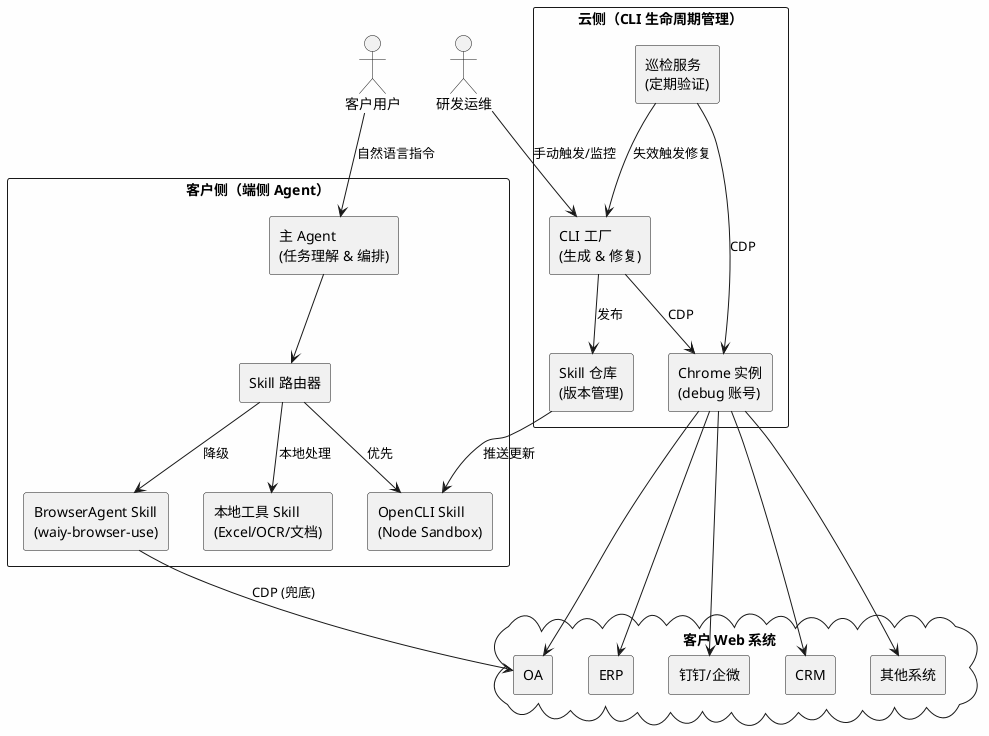
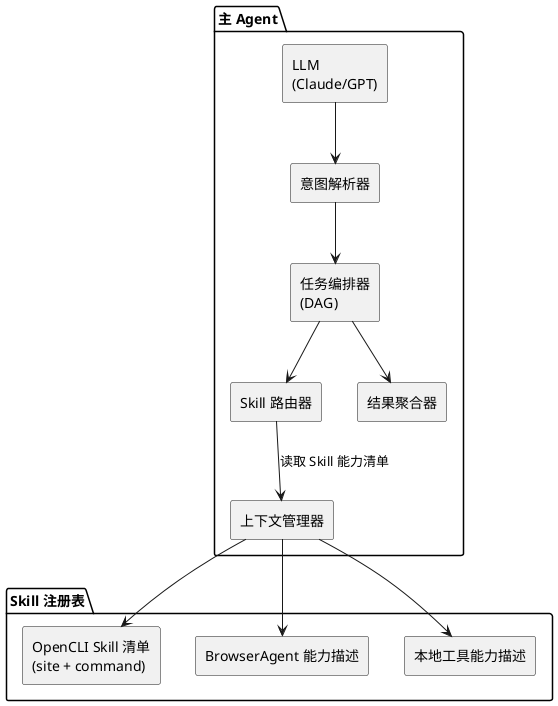
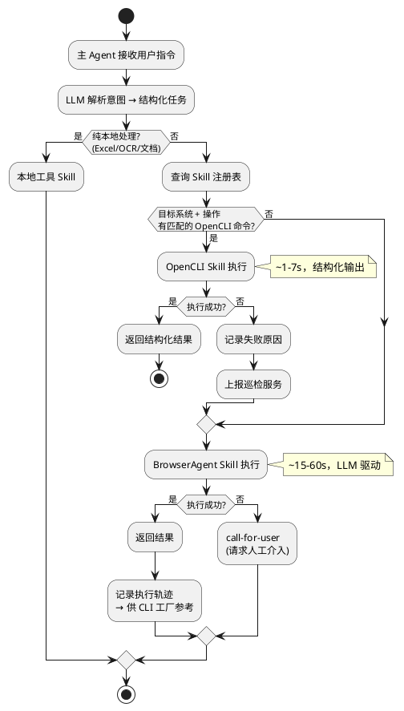
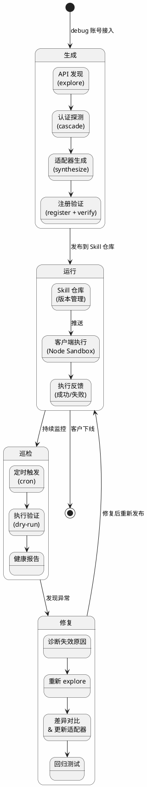
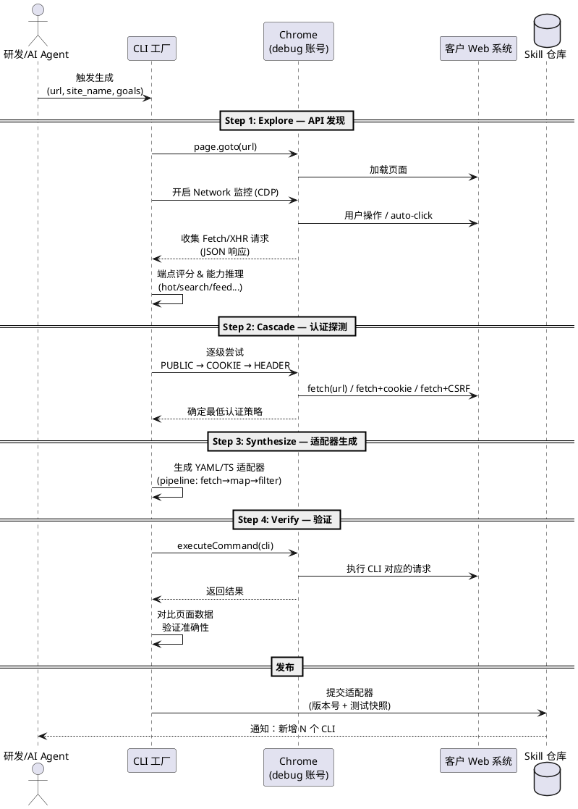
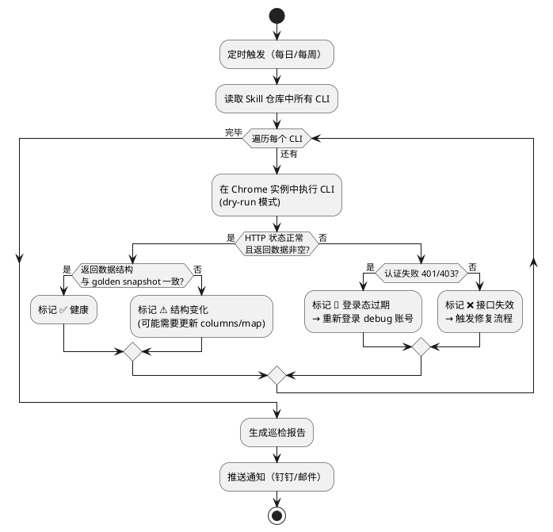
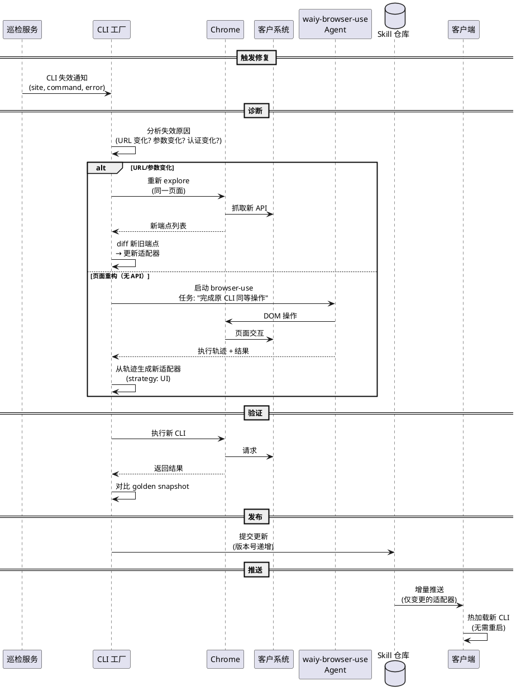
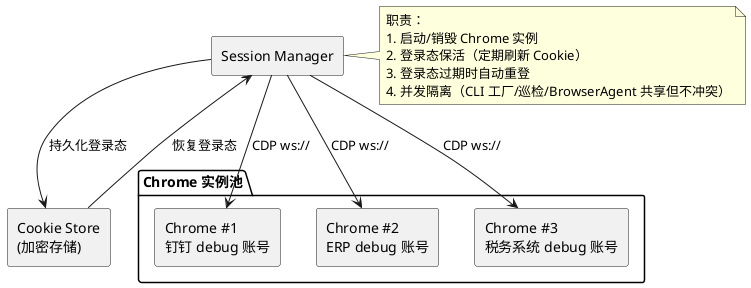
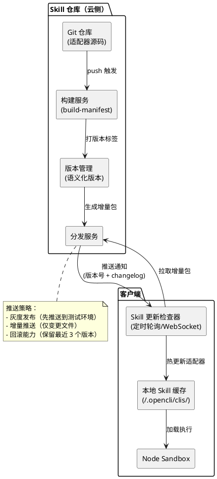
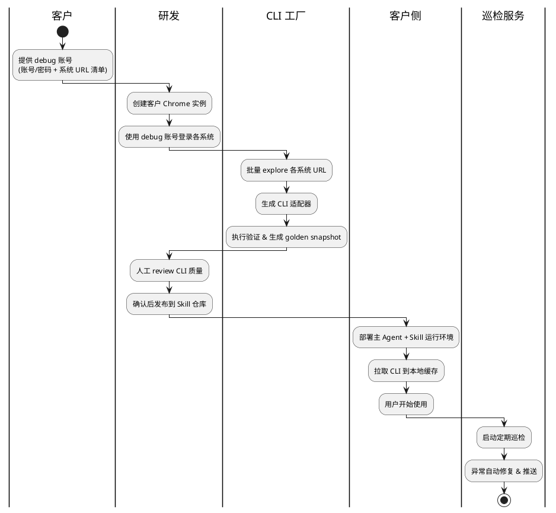

# 办公自动化平台架构设计

> 基于 waiy-browser-use + OpenCLI + 主 Agent 的企业办公自动化平台架构，覆盖 CLI 全生命周期管理（生成→巡检→更新→推送）和任务执行两大核心链路。

---

## 1 业务背景与核心假设

### 1.1 业务场景

客户提供 **debug 账号**，我方研发团队可访问客户办公网内的各类 Web 系统（OA/ERP/CRM/钉钉/企微等）。基于此：

1. **生成网站 CLI**：通过 debug 账号登录客户系统，利用 OpenCLI 自动发现 API、生成 CLI 适配器
2. **定期巡检 CLI**：周期性验证已有 CLI 是否仍可正常执行，发现失效及时修复
3. **更新推送 CLI**：客户网站发生变化后，重新生成/修复 CLI 并推送到客户端（低频）

### 1.2 核心假设

| 假设 | 说明 |
|------|------|
| 客户提供持久 debug 账号 | Cookie/Session 可长期复用，或可通过密码重新登录 |
| 客户网络可达 | 研发侧 Agent 可通过 VPN/专线/公网访问客户 Web 系统 |
| CLI 变更低频 | 网站大改版频率低（季度/年级），巡检修复足以覆盖 |
| 客户端有 Node 运行环境 | OpenCLI Skill 在客户侧以 Node sandbox 方式运行 |

---

## 2 整体架构



### 架构分层

| 层级 | 组件 | 职责 |
|------|------|------|
| **客户侧** | 主 Agent | 接收用户自然语言指令，理解意图，拆解任务，调度 Skill |
| | Skill 路由器 | 根据任务类型和可用 Skill 决定执行路径（OpenCLI 优先 → BrowserAgent 降级） |
| | OpenCLI Skill | 在 Node Sandbox 中执行 CLI 命令，快速、稳定、可复现 |
| | BrowserAgent Skill | waiy-browser-use 驱动浏览器执行复杂交互，作为 OpenCLI 的兜底 |
| | 本地工具 Skill | Excel/OCR/文档处理等不需要浏览器的本地任务 |
| **云侧** | CLI 工厂 | 连接客户 Web 系统，自动发现 API、生成 CLI、测试验证 |
| | 巡检服务 | 定期执行已有 CLI，检测失效，触发修复 |
| | Skill 仓库 | CLI 适配器版本管理、分发、推送 |
| | Chrome 实例 | 承载 debug 账号登录态，为 CLI 工厂和巡检服务提供浏览器环境 |

---

## 3 主 Agent 设计

### 3.1 主 Agent 职责

主 Agent 是用户的唯一交互入口，负责：

1. **意图理解**：将自然语言指令转化为结构化任务
2. **任务拆解**：复杂任务分解为多个子任务（可串行/并行）
3. **Skill 调度**：选择最优 Skill 执行每个子任务
4. **结果整合**：汇总子任务结果，返回给用户
5. **异常处理**：Skill 失败时自动降级或请求人工介入

### 3.2 主 Agent 架构



### 3.3 Skill 路由决策



### 3.4 主 Agent 与 Skill 的调用接口

```python
# 主 Agent 调用 OpenCLI Skill
class OpenCLISkill:
    async def execute(self, site: str, command: str, args: dict) -> SkillResult:
        """在 Node Sandbox 中执行 OpenCLI 命令"""
        # POST localhost:19825/command
        # 或直接 executeCommand(cmd, args)

    async def list_capabilities(self, site: str) -> list[CLICommand]:
        """查询某站点可用的 CLI 命令列表"""
        # 读取 cli-manifest.json

# 主 Agent 调用 BrowserAgent Skill
class BrowserAgentSkill:
    async def execute(self, task: str, url: str) -> SkillResult:
        """启动 waiy-browser-use Agent 执行浏览器任务"""
        agent = Agent(
            task=task,
            llm=self.llm,
            browser=self.browser_session,
        )
        history = await agent.run(max_steps=30)
        return SkillResult(
            success=history.is_done(),
            data=history.final_result(),
            trace=history,  # 执行轨迹，供 CLI 工厂分析
        )
```

---

## 4 CLI 全生命周期管理

这是区别于竞品的核心壁垒：**CLI 不是一次性生成的，而是持续维护的活资产**。

### 4.1 生命周期概览



### 4.2 阶段一：CLI 生成（CLI 工厂）

利用客户提供的 debug 账号，在云侧 Chrome 实例中完成。



**关键实现细节**：

| 步骤 | OpenCLI 现有能力 | 需要扩展 |
|------|-----------------|---------|
| Explore | `opencli explore <url> --site <name>` 自动发现 API | 支持批量 URL 输入；自动登录（debug 账号） |
| Cascade | `opencli cascade <api-url>` 5 级认证探测 | 无需改动 |
| Synthesize | `opencli synthesize <site>` 生成适配器 | 增加 waiy-browser-use 执行轨迹作为输入参考 |
| Verify | `opencli verify` 验证适配器 | 增加结果快照对比（golden test） |

### 4.3 阶段二：CLI 巡检



**巡检策略**：

| 巡检项 | 检测方式 | 频率 | 失败动作 |
|--------|---------|------|---------|
| 接口可达性 | HTTP status code | 每日 | 触发修复 |
| 数据结构一致性 | JSON schema diff vs golden snapshot | 每周 | 告警 + 自动适配 |
| 认证有效性 | 401/403 检测 | 每日 | 自动重新登录 |
| 响应时间 | latency > 10s | 每日 | 告警 |
| 数据正确性 | 关键字段非空 + 采样比对 | 每周 | 告警 |

### 4.4 阶段三：CLI 修复与更新推送



---

## 5 关键模块详细设计

### 5.1 Skill 注册表

Skill 注册表是主 Agent 进行路由决策的依据。结构如下：

```yaml
# skill-registry.yaml — 每个客户一份
sites:
  - site: dingtalk
    domain: oa.dingtalk.com
    auth_strategy: COOKIE
    commands:
      - name: attendance
        description: 导出考勤数据
        args: [date_from, date_to, department]
        columns: [name, date, clock_in, clock_out, status]
        health: ok           # 最近巡检状态
        last_check: 2026-06-13
        version: 1.2.0
      - name: send_message
        description: 发送群消息
        args: [group_id, content]
        health: ok
        last_check: 2026-06-13
        version: 1.0.0

  - site: kingdee
    domain: erp.customer.com
    auth_strategy: HEADER
    commands:
      - name: voucher_list
        description: 查询凭证列表
        args: [period, type]
        health: degraded     # 结构有变化但仍可用
        last_check: 2026-06-13
        version: 2.1.0
```

主 Agent 的 LLM 收到用户指令时，Skill 注册表以摘要形式注入 system prompt：

```
你可以使用以下 OpenCLI 命令：
- dingtalk attendance: 导出考勤数据 (参数: date_from, date_to, department)
- dingtalk send_message: 发送群消息 (参数: group_id, content)
- kingdee voucher_list: 查询凭证列表 (参数: period, type) [⚠️ 结构有变化]
如果以上命令不能满足需求，你可以使用 BrowserAgent 直接操作网页。
```

### 5.2 Chrome 实例管理（debug 账号）



**登录态管理策略**：

| 策略 | 实现 | 适用场景 |
|------|------|---------|
| Cookie 持久化 | 导出/导入 Chrome Cookie 到加密存储 | 大多数 Web 系统 |
| 定时刷新 | 每 4 小时访问一次目标页面，防止 Session 过期 | Session 有效期短的系统 |
| 自动重登 | 检测到 401/403 时，用 debug 账号密码自动登录 | 所有系统 |
| 人工介入 | 短信验证码/U 盾等安全验证，通过通知转交研发处理 | 银行/税务等高安全系统 |

### 5.3 Skill 仓库与推送机制



---

## 6 安全设计

| 安全领域 | 措施 |
|---------|------|
| **debug 账号保护** | 账号密码加密存储（AES-256）；仅云侧 CLI 工厂和巡检服务可访问；审计日志记录所有操作 |
| **客户数据隔离** | 每个客户独立 Chrome 实例 + 独立 Cookie Store；CLI 执行结果不跨客户共享 |
| **CLI 执行沙箱** | OpenCLI 在 Node Sandbox 中运行（受限文件系统 + 网络白名单）；执行超时 30s 强制终止 |
| **传输安全** | Skill 推送走 HTTPS + 签名校验；Chrome CDP 连接走 WSS |
| **权限最小化** | debug 账号仅赋予只读 + 必要写入权限；CLI 适配器声明 `access: read/write` |
| **操作审计** | 所有 CLI 执行记录上报（who/when/what/result）；异常操作实时告警 |

---

## 7 客户接入流程



**典型接入周期**：

| 阶段 | 耗时 | 产出 |
|------|------|------|
| 账号对接 & 环境准备 | 1 天 | Chrome 实例 + 登录态 |
| CLI 批量生成（AI 自动） | 1-2 天 | 每个系统 10-30 个 CLI |
| 人工 review & 调优 | 1-2 天 | 验证通过的 CLI 集合 |
| 客户端部署 & 测试 | 1 天 | 主 Agent 上线 |
| **总计** | **4-6 天** | 完整的数字员工能力 |

---

## 8 与现有代码的对应关系

| 架构组件 | 现有实现 | 需要新增/改造 |
|---------|---------|-------------|
| **主 Agent** | 无（需新建） | 新建主 Agent 服务，集成 LLM + Skill 路由 + 任务编排 |
| **OpenCLI Skill 执行** | `src/execution.ts` — `executeCommand()` | 封装为 Python 可调用的 Skill 接口（通过 HTTP daemon 19825 端口） |
| **BrowserAgent Skill 执行** | `browser_use/agent/service.py` — `Agent.run()` | 封装为 Skill 接口，接受 (task, url) 返回 SkillResult |
| **CLI 生成** | `opencli explore / cascade / synthesize` | 增加批量模式 + debug 账号自动登录 |
| **CLI 巡检** | `opencli verify`（基础验证） | 扩展为定时巡检服务 + golden snapshot 对比 |
| **CLI 推送** | 无 | 新建增量分发服务 |
| **Chrome 实例管理** | bux `browser_keeper.py`（Browser Use Cloud） | 改造为多账号、多实例管理 |
| **Skill 注册表** | `cli-manifest.json`（静态清单） | 扩展为动态注册表（含健康状态、版本） |
| **登录态管理** | OpenCLI COOKIE/HEADER 策略 | 增加自动重登 + Cookie 持久化 |
| **Node Sandbox** | OpenCLI 本地执行 | 增加沙箱隔离（文件系统 + 网络限制） |

---

## 9 技术选型建议

| 组件 | 建议方案 | 理由 |
|------|---------|------|
| 主 Agent 框架 | Python async + LLM（Claude） | 与 waiy-browser-use 同技术栈，便于集成 |
| 任务编排 | 内置 DAG 引擎（轻量级） | 初期任务链简单，不需要 Temporal/Airflow 的复杂度 |
| Skill 注册表存储 | SQLite + JSON 文件 | 单客户数据量小，无需重型数据库 |
| Skill 仓库 | Git 仓库 + 语义化版本 | 天然支持版本管理、diff、回滚 |
| 加密存储 | Python keyring + AES-256 | 账号密码和 Cookie 的安全存储 |
| 巡检调度 | APScheduler / cron | 轻量定时任务 |
| 客户端推送 | HTTP 长轮询 / WebSocket | 低延迟推送 CLI 更新 |

---

## 10 MVP 范围（建议）

第一版聚焦 **"能跑通一个客户的钉钉考勤导出"** 这一条端到端链路：

| 模块 | MVP 范围 |
|------|---------|
| 主 Agent | 支持单轮对话 + 单 Skill 调用（不需要 DAG 编排） |
| OpenCLI Skill | 通过 HTTP daemon 调用已有 CLI |
| BrowserAgent Skill | 直接调用 `Agent.run()` 作为降级路径 |
| CLI 生成 | 手动触发 `opencli explore` + `synthesize` |
| 巡检 | cron + shell 脚本，每日执行一次 |
| 推送 | 手动 scp / rsync 到客户端 |
| Chrome 管理 | 单实例，手动维护登录态 |

**MVP → 完整版的迭代路径**：手动 → 自动、单客户 → 多客户、单系统 → 多系统。
