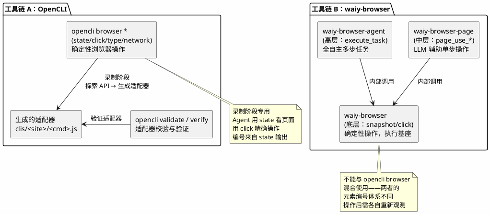
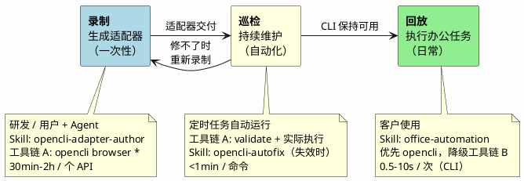
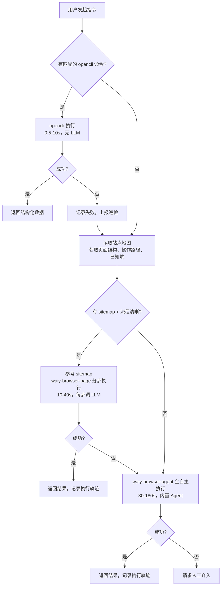
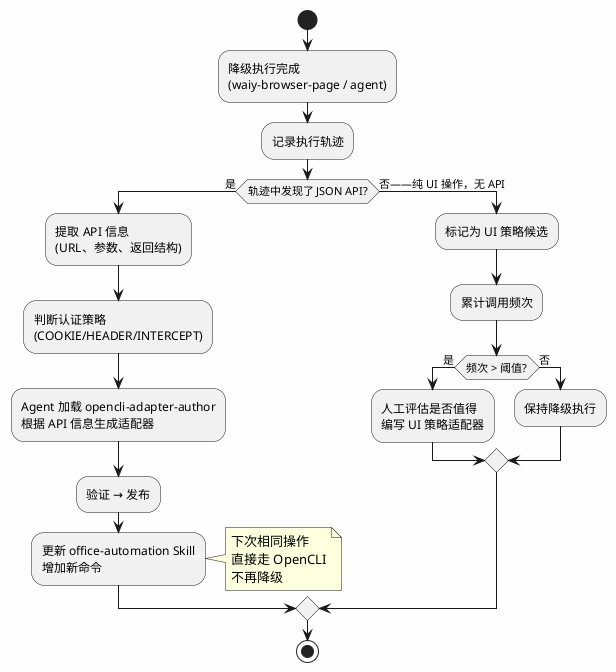
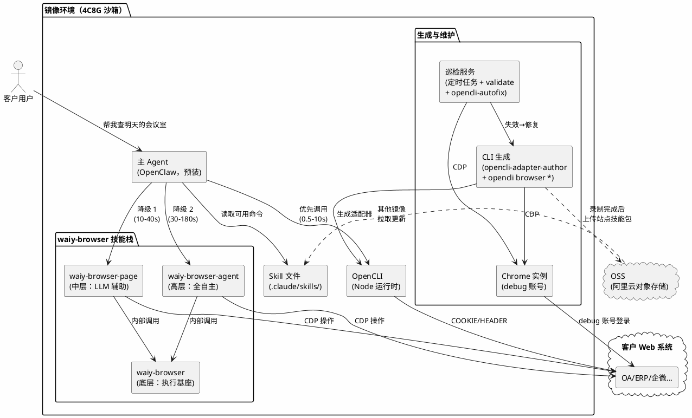
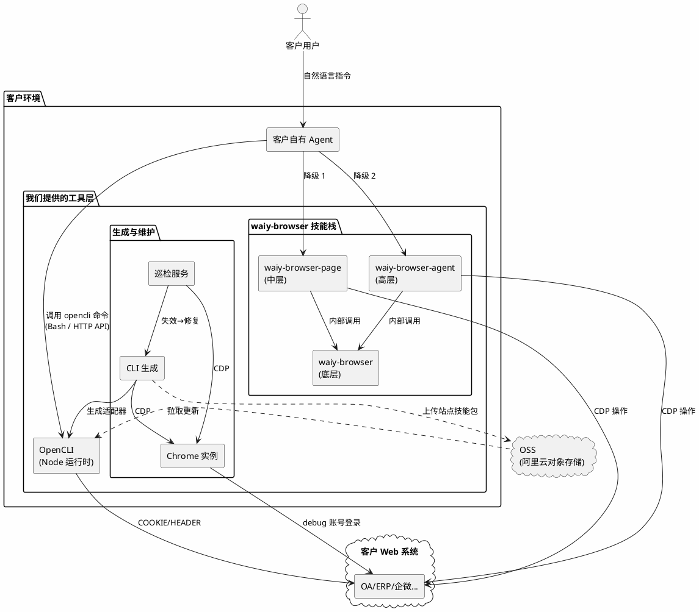

# 办公自动化平台架构设计

基于 OpenCLI + waiy-browser + 主 Agent（OpenClaw）的企业办公自动化方案。

## 一、目标与范围

### 1.1 要解决什么问题

让企业员工通过自然语言完成日常办公操作，覆盖**读和写**两类任务：

| 类型 | 示例 | 占比（预估） |
|------|------|-------------|
| **读**（查询/提取） | "查下明天 3 楼有哪些会议室可用"、"导出本月考勤" | ~70% |
| **写**（提交/操作） | "帮我预订明天下午 302 会议室"、"提交请假申请" | ~30% |

读操作的特点是**高频、重复、可参数化**——同一个查询每天都有人做，只是参数不同。写操作通常是**表单填写 + 按钮提交**，流程固定但步骤多。

### 1.2 为什么不能只用 GUI Agent

纯 GUI Agent（如 waiy-browser-agent）可以完成上述所有任务，但存在三个问题：

| 问题 | 说明 |
|------|------|
| **慢** | 每个操作 30s-5min，每步都要截图 + LLM 推理。"查个会议室"等 3 分钟，用户体验差 |
| **贵** | 每次执行都调用 LLM，查一次会议室消耗的 token 可能比回答一个复杂问题还多 |
| **不稳定** | LLM 每次推理结果可能不同，多步操作的累积误差导致偶发失败 |

**核心矛盾**：70% 的读操作是高频重复的，每次都让 AI 从头看页面、找元素、点击、提取，是巨大的浪费。

### 1.3 选型思路

| 方案 | 速度 | 成本 | 覆盖范围 | 可靠性 |
|------|------|------|---------|--------|
| **纯 web fetch** | 最快 | 最低 | 极低（需要知道 API） | 高 |
| **OpenCLI**（预置适配器） | 快（0.5-10s） | 低（无 LLM） | 中（需预先生成） | 高 |
| **waiy-browser-page**（LLM 辅助分步操作） | 中（10-40s） | 中（每步调 LLM） | 高（任何网页） | 中 |
| **waiy-browser-agent**（全自主 GUI Agent） | 慢（30-180s） | 高（持续调 LLM） | 最高 | 中低 |

纯 web fetch 最快但不现实——企业系统需要登录态、CSRF Token、签名参数等，不是拼个 URL 就能调的。OpenCLI 把这些复杂性封装成适配器，对外暴露简单的 CLI 接口。

**选型结论**：**OpenCLI 做主力（覆盖已知的高频操作），waiy-browser 做降级（覆盖未知或低频操作）**。两者不是替代关系，而是互补——OpenCLI 的覆盖范围随使用逐步扩大（降级执行的轨迹可以反馈生成新 CLI），最终降级越来越少。

### 1.4 核心产品思路

**用高级 Agent 借助 OpenCLI 预先生成结构化产物，客户侧 Agent 消费这些产物来高效完成网站操作。**

录制阶段产出的不止是 CLI 适配器，而是一组完整的**站点技能包**——每个站点一个包，包含该站点自动化所需的全部产物：

| 产物 | 位置 | 内容 | 给谁用 |
|------|------|------|--------|
| **CLI 适配器** | `clis/<site>/<cmd>.js` | 参数化的 API 调用封装 | OpenCLI 执行引擎（确定性执行，最快） |
| **站点地图** | `sitemaps/<site>/` | 页面结构、操作路径、已知坑 | 客户 Agent 降级操作时参考 |
| **回归基准** | `verify/<site>/` | 巡检用的数据快照 | 巡检服务（检测字段变化） |

所有站点技能包 + 一个跨站点的 **Skill 文件**（`.claude/skills/office-automation.md`，汇总所有站点的命令清单 + 降级规则）= 交付给客户的全部产物。

以阿里会议室为例，录制产出的站点地图结构：

```
sitemaps/alimeeting/
├── SITE.md                      # 站点概述：会议室预订系统，需内网 SSO 登录
├── pages/
│   ├── home.md                  # 首页：日历视图 + "预订"入口按钮
│   ├── booking-form.md          # 预订表单页：会议室/时间/时长/参会人
│   └── confirm.md               # 确认页：提交后出现预订成功标志
├── workflows/
│   └── book-room.md             # 从首页到订成的完整操作路径
└── pitfalls.md                  # 已知坑：时间冲突提示、跨天预订限制
```

**站点地图的价值在降级时体现**：当客户 Agent 降级到 waiy-browser-page 操作网页时，它不需要从零探索——读 sitemap 就知道该去哪个页面、走什么路径、有什么坑要避开。这让降级操作更快、更可靠。

站点技能包形成**覆盖梯度**：

```
CLI 适配器存在 → 直接调 opencli（0.5-10s，100% 可靠）
CLI 适配器不存在，但有站点地图 → Agent 参考 sitemap 降级操作（10-40s，可靠性高）
都没有 → Agent 盲操作（30-180s，可靠性低）
```

### 1.5 读 vs 写的实现策略

| | 读（查询/提取） | 写（提交/操作） |
|---|---|---|
| **OpenCLI 能覆盖** | 适配器直接调查询 API，返回结构化数据 | 适配器打开页面后调提交 API（POST/PUT） |
| **OpenCLI 不能覆盖** | 降级到 `waiy-browser-page page_use_extract` | 降级到 `waiy-browser-page page_use_act` |
| **流程太复杂** | 降级到 `waiy-browser-agent execute_task` | 降级到 `waiy-browser-agent execute_task` |

OpenCLI 不只是"读"。适配器可以封装任意 HTTP 请求（GET 查询、POST 提交、PUT 更新），只要背后有 API 就能做。读和写对 OpenCLI 来说都是 `fetch`，区别只是请求方法不同。

## 二、工具与技能全景

在进入具体流程之前，先介绍本方案涉及的所有工具和技能，后续章节会反复引用。

### 2.1 两条独立的工具链

本方案有两条工具链，各自独立，**不混排使用**：



**为什么不能混排**：`opencli browser state` 和 `waiy-browser snapshot` 都返回带编号的页面元素列表，但编号体系各自独立。如果在 `opencli browser state` 之后调用 `waiy-browser click_element_by_index`，编号对不上。反之亦然。每条工具链内部的操作是连贯的，切换工具链后必须重新观测页面状态，之前的编号全部失效。

**各阶段使用哪条工具链**：

| 阶段 | 使用的工具链 | 原因 |
|------|-------------|------|
| **录制** | 工具链 A（opencli browser *） | 需要抓包、分析 API、生成适配器骨架——这些是 OpenCLI 独有的能力 |
| **巡检** | 工具链 A（opencli validate/verify） | 校验和回归测试都是 OpenCLI 内置命令 |
| **回放（有 CLI）** | 直接调 `opencli <site> <command>` | 适配器已生成，不需要浏览器操作 |
| **回放（降级）** | 工具链 B（waiy-browser-page / agent） | 没有 CLI 覆盖时，用 LLM 驱动浏览器完成任务 |

### 2.2 OpenCLI——确定性 CLI 适配器

OpenCLI 把网站操作封装成命令行接口。目前已有 154 个站点适配器。一个适配器的核心结构：

```javascript
cli({
    site: 'alimeeting',
    name: 'rooms',
    strategy: Strategy.COOKIE,    // 认证策略（详见第三章）
    browser: true,
    args: [
        { name: 'date', required: true, help: '日期 YYYY-MM-DD' },
        { name: 'floor', help: '楼层' },
    ],
    columns: ['name', 'floor', 'capacity', 'status'],
    pipeline: [
        { navigate: 'https://meeting.alibaba-inc.com/alimeeting/web#/' },
        { evaluate: `
            const resp = await fetch('/api/meeting/room/list?' + new URLSearchParams({
                date: '$date', floor: '$floor' || ''
            }), { credentials: 'include' });
            return await resp.json();
        `},
        { map: 'data.rooms' },
        { map: room => ({ name: room.roomName, floor: room.floorName, ... }) },
    ],
});
```

**适配器 = 一个网站操作的标准化封装**。声明参数 → 调 API → 格式化输出。写好之后，`opencli <site> <command>` 一行命令调用，不需要知道背后的 API 细节。

### 2.3 waiy-browser 三层架构

waiy-browser 提供三个层级的浏览器自动化能力：

| 层级 | CLI 工具 | 核心命令 | 是否需要 LLM | 单步耗时 | 定位 |
|------|---------|---------|-------------|---------|------|
| **底层** | `waiy-browser` | `snapshot`、`click_element_by_index`、`input_text`、`scroll`、`eval` | 否 | <1s | 确定性浏览器操作 |
| **中层** | `waiy-browser-page` | `page_use_navigate`、`page_use_observe`、`page_use_act`、`page_use_extract` | 是（每步调 LLM） | 5-15s | 自然语言驱动的单页操作 |
| **高层** | `waiy-browser-agent` | `execute_task` | 是（内置 Agent 循环） | 30s-5min | 全自主多步任务 |

**底层**：确定性操作，核心是 `snapshot`（获取页面元素编号）+ `click_element_by_index`（按编号点击）。编号是临时的，每次 snapshot 重新分配，因此只能在 Agent 实时交互时使用（看一步、操作一步），不能写死在脚本里回放。底层同时也是中层和高层的执行基座——`page_use_act` 和 `execute_task` 内部都是调用这些底层命令操作页面。

**中层**：调用者用自然语言描述每步操作意图，LLM 理解页面后执行。适合流程清晰、可分步描述的操作。底层的 page 模块还提供：
- **LoginFlow**：自动检测登录表单（含 iframe）→ 执行登录 → 验证成功
- **PageExtractor**：结构化数据提取 + 自动翻页（带去重），支持 JSON Schema 定义输出格式
- **PageActor**：操作前后 DOM 稳定性检查（元素 hash 对比），确保页面变化符合预期

**高层**：接收一个自然语言任务描述，内置 Agent 自主规划和执行所有步骤。适合流程复杂或不确定的一次性操作。同一时间只能运行一个 `execute_task`，超时至少 600s。

### 2.4 Skill 清单

Skill 是给 AI Agent 看的决策指南（"什么时候做什么、怎么做"），Agent 根据 Skill 的指引调用具体的命令。命令本身不需要 Skill 就能执行。

**工具链 A（OpenCLI）相关 Skill：**

| Skill | 所属阶段 | 做什么 | 什么时候用 |
|---|---|---|---|
| `opencli-adapter-author` | 录制 | **主力**。完整的适配器生成决策树 + runbook | 给新站点写 CLI 时 |
| `opencli-browser` | 录制 | 浏览器操作手册（`state/find/click/type/network` 等子命令的用法） | adapter-author 过程中驱动浏览器 |
| `opencli-sitemap-author` | 录制 | 站点地图编写（记录页面结构和导航路径） | 复杂站点需要先摸清页面结构时 |
| `opencli-browser-sitemap` | 录制 | 站点地图消费（读取已有 sitemap 加速探索） | 有 sitemap 的站点，跳过重复探索 |
| `opencli-usage` | 录制 | 入门指南（命令总览、策略说明、路由表） | 不知道用什么命令时查 |
| `opencli-autofix` | 巡检 | 自动修复失效适配器（诊断 → 探查 → patch → 重试，最多 3 轮） | 巡检发现 CLI 失效时自动触发 |

**工具链 B（waiy-browser）相关 Skill：**

| Skill | 层级 | 做什么 | 什么时候用 |
|---|---|---|---|
| `waiy-browser` | 底层 | 确定性浏览器操作 | page/agent 层的执行基座（不直接在回放中独立使用） |
| `waiy-browser-page` | 中层 | 自然语言单页操作 | 回放降级（分步操作）；结构化数据提取 |
| `waiy-browser-agent` | 高层 | 全自主多步任务执行 | 回放降级（复杂任务兜底） |

**交付给客户的 Skill：**

| Skill | 做什么 |
|---|---|
| `office-automation` | 告诉主 Agent 有哪些 opencli 命令可用、怎么调、什么时候降级到 waiy-browser-page / waiy-browser-agent |

客户只看到 `office-automation` 这一个 Skill，不需要接触上面的开发和维护 Skill。

### 2.5 内置命令（不需要 Skill）

| 命令 | 做什么 | 在哪个阶段用 |
|------|--------|-------------|
| `opencli validate <site>` | 校验适配器定义是否合法（语法、字段对齐） | 录制（验证产出）、巡检（定期检查） |
| `opencli browser verify <site> <cmd>` | 用真实 Cookie 执行一次，核对返回数据 | 录制（端到端验证）、巡检（回归测试） |
| `opencli browser analyze <url>` | 分析站点结构，推荐认证策略 | 录制（起步） |
| `opencli browser network capture-*` | 抓包（开始/读取/停止） | 录制（发现 API） |
| `opencli browser state/click/type` | 查看页面元素 / 操作元素 | 录制（Agent 探索页面） |

## 三、认证策略

不同网站获取数据的方式不同，OpenCLI 把它分成五级策略。每级策略决定了适配器的实现方式和运行时开销：

| 策略 | 实现方式 | 单次执行耗时 | 典型场景 |
|------|---------|-------------|---------|
| **PUBLIC** | 直接 HTTP 请求公开 API，不需要浏览器 | ~0.5s | npm、PyPI、HackerNews 等公开平台 |
| **COOKIE** | 在浏览器环境中发请求，自动带用户 Cookie | ~7s | 企业 OA、ERP、会议系统等需登录的后台 |
| **HEADER** | 从 Cookie 提取 CSRF Token 加到请求头 | ~7s | Twitter GraphQL 等有 CSRF 保护的 API |
| **INTERCEPT** | 拦截 XHR/Fetch 获取签名参数后重放 | ~10s | 小红书等有请求签名的站点 |
| **UI** | 直接操作 DOM 提取数据（无可用 API） | ~15s+ | 无 JSON API 的遗留系统 |

**客户的办公系统**（OA/ERP/企微/会议系统等），绝大多数走 COOKIE 或 HEADER 策略——这些系统的前端操作背后都有 JSON API，只需要登录态。写操作（提交表单）同样是调 API（POST/PUT），只是请求方法不同。

## 四、三个阶段：录制 → 巡检 → 回放

整个流程分三个阶段。前面介绍的工具和 Skill 分别在不同阶段发挥作用：



| | 录制（生成适配器） | 巡检（持续维护） | 回放（执行办公任务） |
|---|---|---|---|
| **谁操作** | 研发或用户 + 主 Agent | 定时任务 + `opencli-autofix` skill | 客户的主 Agent（自动） |
| **频率** | 一次性（每个 API 做一次） | 每天/每周自动执行 | 反复执行（每天/每周） |
| **用的 Skill** | `opencli-adapter-author` | `opencli-autofix`（失效时自动修复） | `office-automation` |
| **工具链** | A（opencli browser *） | A（validate/verify） | opencli 优先，B（waiy-browser）降级 |
| **需要浏览器** | 需要（探索 + 验证） | COOKIE/UI 策略需要 | 看 strategy |
| **产出** | 站点技能包（适配器 + 站点地图 + 回归基准）+ Skill | 健康报告 / 修复 patch | 结构化数据 |
| **耗时** | 30min-2h / 个 API | 巡检 <1min/命令；修复 1min-4h | 0.5-10s / 次 |

### 4.1 巡检具体做什么

1. **每天**：定时任务跑 `opencli validate <site>` 校验适配器定义 + 对每个命令执行一次（取前 3 条数据），确认接口可达、返回非空
2. **每周**：比对返回数据与 fixture（`verify/<cmd>.json`）的结构，检查字段是否变化
3. **失效时**：自动触发 `opencli-autofix` skill——诊断错误类型（401/404/字段缺失）→ 用 `opencli browser` 重新探查 → 自动 patch 适配器 → 重试（最多 3 轮）
4. **修不了时**：告警通知研发手动介入（回到录制阶段重做）

## 五、回放阶段的降级路径

客户日常使用时，主 Agent 按以下优先级执行用户指令。**站点地图在降级时起关键作用**——Agent 读取 sitemap 知道该去哪个页面、走什么路径、避开什么坑，不需要从零探索。



### 5.1 三级降级对照

| 维度 | OpenCLI | waiy-browser-page（中层） | waiy-browser-agent（高层） |
|------|---------|--------------------------|--------------------------|
| 速度 | 0.5-10s | 10-40s（3-5 步） | 30-180s |
| 可靠性 | 高（固定 API 调用） | 中（有 sitemap 时更高） | 中低（多步 LLM 累积误差） |
| 覆盖范围 | 低（需预先生成适配器） | 高（任何网页） | 高（任何网页） |
| LLM 成本 | 无 | 每步调一次 LLM | 持续调 LLM（规划 + 执行） |
| 控制粒度 | 精确（参数化 CLI） | 中（调用者分步控制） | 低（只给目标，Agent 自主） |
| 适用场景 | 高频、重复、结构化 | 流程清晰的降级操作 | 复杂/不确定的一次性操作 |

底层 `waiy-browser` 不出现在降级链中——它的 `snapshot` 返回临时元素编号，无法在无人值守场景下独立工作。但它是 page 和 agent 层的执行引擎，间接参与所有降级操作。

### 5.2 降级示例

**查询（读）——没有对应 CLI 时：**

```bash
# 用 waiy-browser-page 分步提取
waiy-browser-page page_use_navigate "https://oa.company.com/attendance"
waiy-browser-page page_use_extract "提取本月考勤记录" \
  --field-schema '{"type": "array", "items": {"type": "object", "properties": {"date": {"type": "string"}, "status": {"type": "string"}}}}'
# 总耗时 15-30s
```

**操作（写）——没有对应 CLI 时：**

```bash
# 方式 A：waiy-browser-page 分步操作（流程清晰时）
waiy-browser-page page_use_navigate "https://oa.company.com/leave"
waiy-browser-page page_use_act "点击'申请请假'按钮"
waiy-browser-page page_use_act "选择请假类型为'事假'，填写开始日期 2026-06-15，结束日期 2026-06-16"
waiy-browser-page page_use_act "点击提交按钮"
# 总耗时 20-40s

# 方式 B：waiy-browser-agent 全自主执行（流程复杂时）
waiy-browser-agent execute_task \
  "打开 OA 系统 https://oa.company.com/leave，提交请假申请：6月15日-6月16日，事假" \
  --timeout 600
# 总耗时 30-180s
```

### 5.3 Skill 自进化——降级轨迹如何转化为新 CLI

降级执行不是终点，而是 CLI 扩展的信号源。

**轨迹记录的内容**：

waiy-browser-page 和 waiy-browser-agent 执行时，底层的每一步操作都会产生日志：
- 访问的 URL 和页面跳转路径
- 触发的网络请求（URL、Method、Request/Response Body）
- DOM 操作序列（点了什么元素、填了什么值）
- 页面状态变化（操作前后的关键 DOM 结构）

**转化流程**：



**关键判断逻辑**：
- 如果降级过程中**发现了 JSON API**（Network 请求里有 JSON 响应），说明这个操作可以用 COOKIE/HEADER/INTERCEPT 策略封装成 CLI，值得立即生成适配器
- 如果降级过程是**纯 UI 操作**（没有可用的 JSON API），生成 CLI 的成本较高（UI 策略适配器编写复杂、维护成本大），只有在调用频次足够高时才值得投入

**效果**：随着使用量增长，高频操作逐步从降级路径"毕业"到 OpenCLI，降级比例持续下降。理想状态下，客户日常 90%+ 的操作都走 OpenCLI（秒级响应），只有偶发的新操作才触发降级。

## 六、实测数据

### 6.1 沙箱环境实测（4C8G / 5Mbps 带宽）

在云端沙箱环境（4C8G Ubuntu，5Mbps 出口带宽）中对 PUBLIC 策略 CLI 进行了实测：

| 测试项 | 命令 | 沙箱耗时 | 本地推算* | 结果 |
|--------|------|----------|----------|------|
| npm 搜索 | `opencli npm search react --limit 3` | **0.60s** | ~0.25s | ✅ 3 条结构化结果 |
| npm 包信息 | `opencli npm package lodash` | **0.43s** | ~0.18s | ✅ 元数据完整 |
| PyPI 包信息 | `opencli pypi package requests` | **0.46s** | ~0.20s | ✅ 元数据完整 |
| crates 搜索 | `opencli crates search serde --limit 2` | **1.29s** | ~0.55s | ✅ 2 条结果 |
| 适配器校验 | `opencli validate npm` | **0.35s** | ~0.30s | ✅ 3 命令全通过 |
| 适配器校验 | `opencli validate pypi` | **0.35s** | ~0.30s | ✅ 2 命令全通过 |

\* 本地推算基于 Apple M2 Pro 32G + 100Mbps 网络环境。PUBLIC 策略主要耗时在网络延迟（API 请求），本地 100Mbps 网络的 RTT 通常比沙箱 5Mbps 低 50-60%。

### 6.2 各执行方式耗时对照

下表对比的是**单次用户任务的端到端耗时**（从发起请求到拿到结果）：

| 执行方式 | 沙箱（4C8G / 5Mbps） | 本地（M2 Pro / 100Mbps） | 耗时因素 | 需要 LLM |
|---------|----------------------|--------------------------|---------|----------|
| **OpenCLI PUBLIC** | 0.4-1.3s | 0.2-0.6s | 网络 RTT | 否 |
| **OpenCLI COOKIE** | 7-12s | 5-8s | 浏览器启动 + 页面加载 | 否 |
| **OpenCLI INTERCEPT** | 10-15s | 8-12s | 页面加载 + 等待 XHR | 否 |
| **OpenCLI UI** | 15-25s | 12-20s | DOM 渲染 + 元素操作 | 否 |
| **waiy-browser-page**（降级 1） | 20-60s | 10-40s | 每步 LLM 推理（3-5 步） | 是（每步） |
| **waiy-browser-agent**（降级 2） | 60-300s | 30-180s | 多步 Agent 循环 + LLM | 是（持续） |

OpenCLI 比 waiy-browser-page 快一个数量级，比 waiy-browser-agent 快两个数量级。降级层的 LLM 调用是主要成本来源。客户实际部署的镜像环境（4C8G + 5Mbps）中，OpenCLI 的 COOKIE 策略（大部分企业系统）7-12s 返回，用户体验可接受。

## 七、整体架构

主 Agent 接收用户指令，优先用 OpenCLI 执行（快、稳、无 LLM 成本），不行就降级到 waiy-browser-page（LLM 辅助按步操作），最后兜底用 waiy-browser-agent（全自主）。

**除主 Agent 外的所有组件（OpenCLI、waiy-browser、巡检服务、CLI 生成能力、Chrome 实例）都打包在镜像中交付给客户**，自包含运行。站点技能包和 Skill 文件的多客户分发通过 OSS（阿里云对象存储）：沙箱内录制完成后上传到 OSS，其他镜像从 OSS 拉取更新。

实际部署有两种模式：客户使用镜像环境中预装的主 Agent，或客户使用自有 Agent 对接。

### 7.1 模式 A：镜像环境部署（更常见）

客户使用我们提供的镜像环境，主 Agent + 全部工具链 + 巡检 + CLI 生成能力全部预装，开箱即用。



**特点**：
- 客户不需要自己搭环境，镜像里全部就绪（包括 CLI 生成和巡检能力）
- 镜像内的 Chrome 实例维护 debug 账号登录态，巡检定时任务自动运行
- 新增站点技能包在镜像内完成录制、验证后，上传到 OSS 分发给其他镜像
- 适合大部分客户场景

### 7.2 模式 B：客户自有 Agent 对接

客户已有自己的 Agent 框架（或使用其他 LLM Agent），我们提供除主 Agent 外的全部组件。



**特点**：
- 客户自己维护 Agent，我们提供 OpenCLI + waiy-browser + 巡检 + CLI 生成能力作为工具层
- 客户需要自己实现降级逻辑（参考 `office-automation` Skill 的规则）
- OpenCLI 可通过 Bash 调用或 HTTP daemon（`:19825`）对接
- 巡检和 CLI 生成同样在客户环境内运行
- 站点技能包更新通过 OSS 分发
- 适合有技术能力、已有 Agent 框架的客户

## 八、交付形式——站点技能包

交付给客户的是**一组站点技能包 + 一个 Skill 文件**。站点技能包按站点组织，每个包包含该站点自动化所需的全部产物；Skill 文件汇总所有站点的命令清单和降级规则，供主 Agent 决策。

### 8.1 目录结构

```
# 站点技能包（每站点一个）
clis/
├── alimeeting/
│   ├── rooms.js              # 查询可用会议室
│   ├── book.js               # 预订会议室
│   └── my-bookings.js        # 查看我的预订
├── kingdee/
│   ├── voucher-list.js
│   └── ap-aging.js
└── oa/
    └── leave-list.js

sitemaps/
├── alimeeting/
│   ├── SITE.md               # 站点概述
│   ├── pages/                # 各页面结构
│   ├── workflows/            # 操作路径
│   └── pitfalls.md           # 已知坑
├── kingdee/
│   └── ...
└── oa/
    └── ...

verify/
├── alimeeting/
│   ├── rooms.json            # 回归基准
│   └── my-bookings.json
├── kingdee/
│   └── ...
└── oa/
    └── ...

# 跨站点 Skill 文件（一个）
.claude/skills/office-automation.md
```

### 8.2 Skill 文件示例

Skill 文件是站点技能包的"索引"——告诉主 Agent 有哪些命令可用、怎么用、什么时候降级：

```markdown
# office-automation skill

你可以使用 opencli 命令操作客户的办公系统。

## 可用命令

### 阿里会议（alimeeting）
- `opencli alimeeting rooms --date 2026-06-15 --floor 3F`
  查询可用会议室
- `opencli alimeeting book --room 302 --date 2026-06-15 --start 14:00 --end 15:00`
  预订会议室
- `opencli alimeeting my-bookings --date 2026-06-15`
  查看我的预订

### ERP（金蝶）
- `opencli kingdee voucher-list --period 202606`
  查询凭证列表
- `opencli kingdee ap-aging`
  应付账龄分析

### OA 系统
- `opencli oa leave-list --month 2026-06`
  查询请假记录

## 降级规则
1. 优先使用 opencli 命令（快、稳、无 LLM 成本）
2. 如果没有对应命令或执行失败，读取 sitemaps/<site>/ 了解页面结构，
   用 waiy-browser-page 分步操作
3. 流程复杂或不确定时，用 waiy-browser-agent 全自主执行
4. 需要登录时使用已保存的 Cookie（自动注入），LoginFlow 可自动处理登录表单
```

### 8.3 增量更新

站点技能包不是一次性写完的——每录制一个新的 CLI 适配器，对应站点的技能包就多一个文件，Skill 文件里增加一条命令说明。新站点接入时，新建一个站点技能包目录。整个过程由主 Agent 在录制阶段自动完成（提交 Git + 上传 OSS 分发）。

## 九、与现有代码的对应关系

| 架构组件 | 现有代码 | 状态 |
|---------|---------|------|
| 主 Agent | OpenClaw | ✅ 直接使用 |
| OpenCLI 执行引擎 | `src/execution.ts` / HTTP daemon :19825 | ✅ 已有 |
| 浏览器操作命令 | `opencli browser *`（30+ 子命令） | ✅ 已有 |
| 适配器编写 skill | `skills/opencli-adapter-author/SKILL.md` | ✅ 已有 |
| 适配器校验 | `opencli validate` | ✅ 已有 |
| 适配器验证 | `opencli browser verify` | ✅ 已有 |
| 降级层 1：分步操作 | `waiy-browser-page page_use_*` | ✅ 已有 |
| 降级层 2：全自主 | `waiy-browser-agent execute_task` | ✅ 已有 |
| 底层执行引擎 | `waiy-browser snapshot/click/input` | ✅ 已有 |
| 自动登录 | `browser_use/page/login_flow.py` → `LoginFlow` | ✅ 已有 |
| 结构化提取+翻页 | `browser_use/page/extractor.py` → `PageExtractor` | ✅ 已有 |
| 巡检服务 | 需要新建（定时任务 + shell 脚本） | ❌ 待建 |
| 登录态管理 | 部分有（OpenCLI Cookie 策略） | 🟡 需扩展 |
| 站点技能包分发（OSS） | 无 | ❌ 待建 |
| 客户 Skill 文件 | `.claude/skills/` 框架已有 | 🟡 需定制 |

## 十、客户接入 checklist

| 步骤 | 耗时 | 产出 | 谁做 |
|------|------|------|------|
| 1. 获取 debug 账号 | 1 天 | 账号密码 + 系统 URL 清单 | 客户 |
| 2. 镜像内 Chrome 登录 | 1 小时 | 各系统登录态就绪 | 研发 |
| 3. 逐系统生成站点技能包 | 1-2 天/系统 | `clis/` + `sitemaps/` + `verify/` | OpenClaw + 研发 review |
| 4. 验证全部 CLI | 半天 | `opencli validate` + 实际执行全部通过 | 研发 |
| 5. 编写 Skill 文件 | 2 小时 | `.claude/skills/office-automation.md` | 研发 |
| 6. 部署镜像 | 半天 | 站点技能包 + Skill 在镜像环境跑通 | 研发 + 客户 IT |
| 7. 配置巡检 | 1 小时 | 定时任务 | 研发 |
| **总计** | **4-6 天** | 可用的数字员工 | |

## 十一、MVP 建议

第一个客户的第一个场景："阿里会议室查询 + 预订"。

| 模块 | MVP 范围 | 不做什么 |
|------|---------|---------|
| 主 Agent | OpenClaw + 1 个 Skill 文件 | 不造新 Agent 框架 |
| CLI 生成 | 手动 OpenClaw + opencli browser | 不做全自动 explore |
| CLI 执行 | 直接跑 opencli 命令 | 不做 HTTP daemon |
| 降级路径 | `waiy-browser-page` 分步操作 | 不做自动降级路由 |
| 巡检 | 定时任务 + shell 脚本 | 不做巡检平台 UI |
| 推送 | rsync 手动同步 | 不做自动分发 |
| 登录态 | 手动维护 Cookie | 不做自动重登 |

**MVP 验证成功后，再逐步自动化每个环节。**
